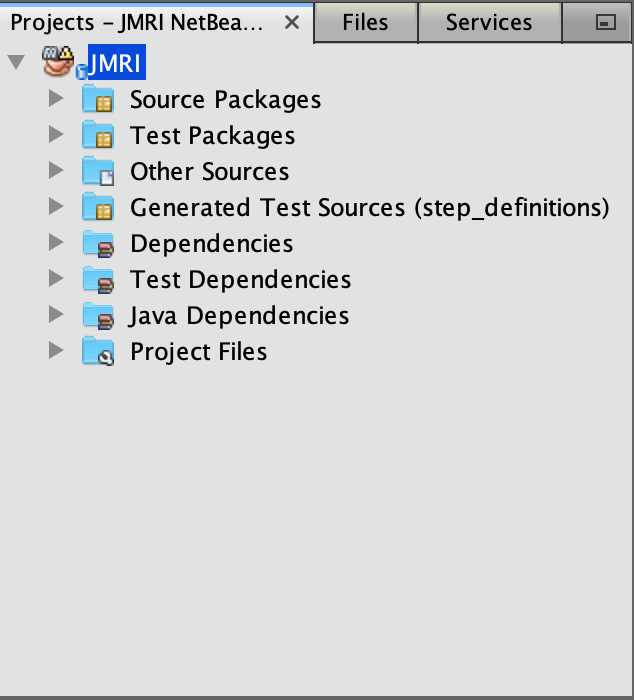
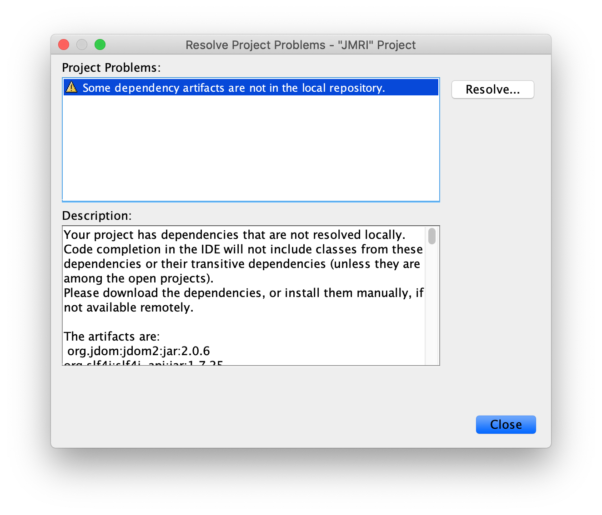
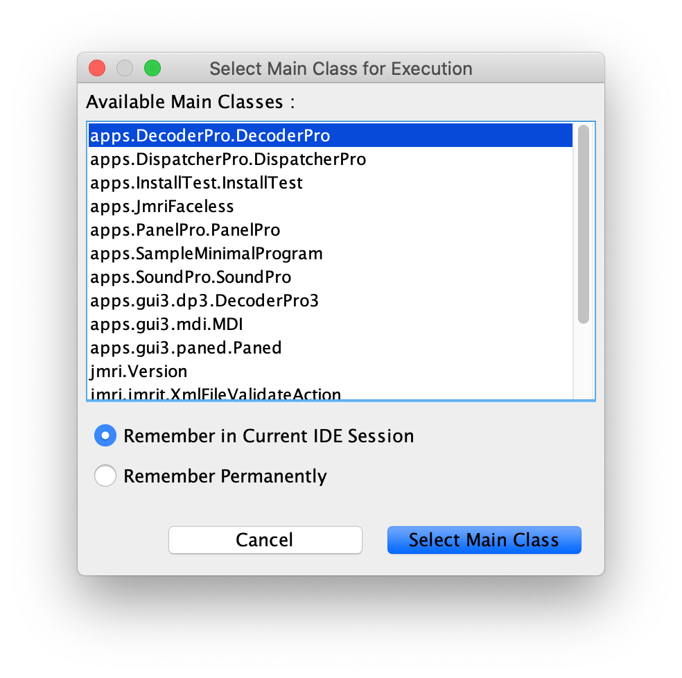
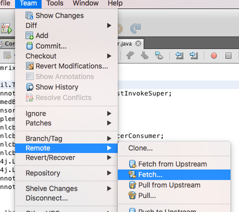
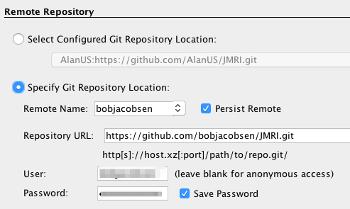
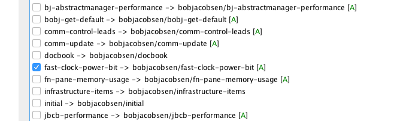
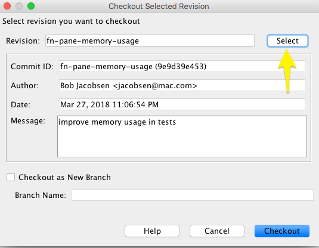
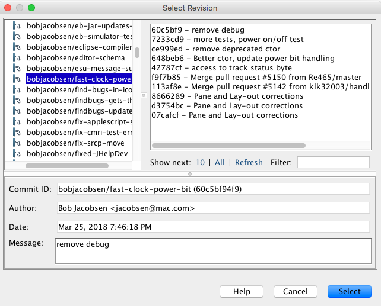

= JMRI Code: Building with Apache NetBeans
:experimental:

== Introduction

https://netbeans.apache.org[Apache NetBeans] makes a great platform for working with JMRI. The JMRI code is set up to work with Apache NetBeans with almost no additional setup.

Apache NetBeans is a very powerful Integrated Development Environment (IDE), which can make working with the JMRI code pretty easy. But it takes a little getting used to, and reading the https://netbeans.apache.org/help[tutorials] will be helpful.

== Installation

. Download and install a Java 8 or newer https://adoptopenjdk.net[Java Development Kit (JDK)] (It is recommended to use a package manager if possible to ensure security updates can be automatically installed)
. Download Apache NetBeans from http://netbeans.apache.org/download[netbeans.apache.org] (It is recommended to use a package manager if possible to ensure security updates can be automatically installed)
. Run the Apache NetBeans installer

=== Linux

Apache NetBeans can also be installed as a https://snapcraft.io/netbeans[snap package] for Linux.

=== macOS

Apache NetBeans and the Java 8 JDK can be installed using https://brew.io[Homebrew] from the terminal:

----
brew cask install adoptopenjdk8 netbeans
----

=== Windows

[NOTE]
====
Due to different handling of Line Endings characters (`LF / CR LF`)
between Windows and other systems - namely Unix and OS X (see
link:GitFAQ.shtml#lineends[Handling Line Ends]) - it is of the utmost
importance that all Windows users adopt the following settings for their
development environment. This is absolutely required so that Git can
track individual changes on files that you commit.

If you don't follow these instructions, you'll mess up the line endings
in the files you commit, which will in turn make their revision history
much harder to access. Files in this condition will not be accepted as
pull requests.

As a first step, as JMRI has adopted `LF` as a convention for Line
Endings, it is required to set the `core.autocrlf` setting to `true`
(see https://help.github.com/articles/dealing-with-line-endings["Dealing
with line endings" on GitHub Help)]
====

[IMPORTANT]
====
You **must** install and configure the http://plugins.netbeans.org/plugin/46829/change-line-endings-on-save["Change Line Endings on Save" plugin] before using Git via Apache NetBeans.
====

==== _Change Line Endings on Save_ Plugin

===== Installation
. Choose menu:Tools[Plugins]
. Click btn:[Settings]
. Select _Netbeans Plugin Portal_ and ensure it is active
. Click btn:[Available Plugins]
. Select _Change Line Endings on Save_
. Click btn:[Install]
. Follow the prompts to complete installation
. Restart Apache NetBeans when prompted

==== Configuration
link:images/NetbeansChangeLineEndingsPluginConfiguration.png[image:images/NetbeansChangeLineEndingsPluginConfiguration.png[Configuration Window,237,168,role="related right"]]

. Choose menu:Tools[Options]
. Click btn:[Editor]
. Click btn:[Line Endings]
. Select _Enable adjusting the line endings_
. Choose _Unix (LF)_ from the popup menu
. To be prompted before line endings are adjusted, select _Show confirmation dialog before adjusting the line endings_
. Click btn:[OK]
You can check that the plug-in is properly installed by going to go to
`Tools > Plugins > Installed`, where you should
see something like this (versions might differ):

== Using Apache NetBeans with JMRI's Git Code Repository

GitHub provides JMRI's code repository using the Git tool. For more
information on how JMRI uses Git, see the JMRI Help on
link:getgitcode.shtml[Getting the code via Git] and
link:GitFAQ.shtml[Git FAQ].

Once set up, Apache NetBeans provides built-in support for using Git.

For more information on Git and Apache NetBeans, see the
https://netbeans.org/kb/docs/ide/git.html[NetBeans Git help page]

=== Checking out code

In Apache NetBeans, under the "Team" menu, select Git, then Clone
Repository. Enter the https://github.com/JMRI/JMRI.git repository URL
from the https://github.com/JMRI/JMRI[JMRI GitHub page] on the Apache
NetBeans form under "Repository URL". We recommend that you also enter
your GitHub user name and password on the form, so we can attribute your
contributions to you later. Click "Next". Make sure that the "master*"
box is checked to pull down the main version of the code. Click "Next",
and then click "Finish".

It'll take a long time to pull down a copy of the code (note the
progress bar in the lower right), but then you're good to go.

=== Local Commits

When using Git, the "commit" operation is local to your computer. It
doesn't make any changes to the main JMRI repository.

You're encouraged to commit often, so that your changes are safely
stored away from your working directory. Having each small change
separately recorded can be incredibly helpful later on if you have to
track down where a problem was introduced.

=== Updating the code from Git

From time to time, you should update your local copy of the code to
match the current "HEAD" of the main JMRI Git repository contents. The
basic process is to pull the most recent copies from the main JMRI
repository, doing any merging that's needed if you've made conflicting
changes, and then pushing that up to your own GitHub repository.

To do this, use the Apache NetBeans [Team] -> [Remote] -> [Pull from
Upstream] menu choice. Tell Apache NetBeans to pull from the "github"
remote you defined above.

You may also update a single file or the contents of a folder, by
right-clicking on an item in the "Files" window, then selecting [Git] ->
[Remote] -> [Pull from Upstream].

=== Creating a Pull Request

A "Pull Request" (PR) is an easy way to gather up all your changes, even
if they span multiple files, into something that you can then submit for
inclusion in the main JMRI repository.

First, you need to set up a GitHub account and your own repository.

* Get a https://github.com/join[GitHub account] and login
* Tell GitHub to https://help.github.com/articles/fork-a-repo/["fork"
JMRI's repository] into one of your own. There's a
https://help.github.com/articles/fork-a-repo/[good help page], but
basically you go to the https://github.com/JMRI/JMRI[JMRI repository
page] and click the "fork" button in the upper right.

This gives you your own repository, which you can then work with freely.

Next, push the changes up to your repository. (Anybody can push to their
own repository, but most people don't have permission to directly modify
the main JMRI repository; that's why the pull request is needed) To do
this:

* Use the Apache NetBeans [Team] > [Remote] > [Push ...] menu choice.
(If you try to use the "Push to Upstream" choice, it will try to write
back to the main repository, and will fail.)
* Click on Specify Git Repository, and enter the URL for your own
repository, e.g. https://github.com/yourname/JMRI.git
* Then click next.
* Apache NetBeans will check with the repository, and show an indication
of branches to push e.g. "master -> master" Check the appropriate box to
for the branch you've been working on.
* Click Next and Finish. Netbeans will do the actual push to your
repository.

You can repeat this as many times as you'd like as you're working on
your changes. Each time, the most recent changes are pushed up and made
available.

Finally, when your change is ready to submit, go to the GitHub website
to link:gitdeveloper.shtml#pull[fill out and submit a pull request].

Eventually, somebody will look at the pull request and decide whether to
merge it in. Sometimes they'll ask for additional changes. In that case,
you can update the pull request by just pushing new changes to the your
repository, where they'll automatically be picked up.

== Building and running JMRI

TIP: Ensure your computer is connected to the internet the first time you build, test, or run JMRI after checking out a new copy of JMRI from GitHub to allow any potentially missing external dependencies or build tools to be automatically downloaded.

=== Prime

link:images/netbeans-project-warning.png[]
The first time you open the JMRI project in Apache NetBeans, a warning icon will be shown on the project. This warning indicates Apache NetBeans has a problem with the project. Ususally the first time warning indicates that build artifacts are missing.

To resolve this problem:

. Select the JMRI project
. Choose menu:shortcut{sp}menu[Resolve Project Problems...] (the shortcut menu is usually opened by right-clicking on the project)
 link:images/netbeans-resolve-project-problems-menu.png[Show example...]
. link:images/netbeans-resolve-project-problems.png[]Click btn:[Resolve...]
. Click btn:[Close] once the warning icon changes to an OK icon

NOTE: You may also see an error icon if using a JDK version greater than 8 due to changes in how Java interacts with macOS in JDK versions 9 or newer.

=== Build

To build JMRI, choose menu:Run[Build Project (JMRI)] or menu:Run[Clean and Build Project (JMRI)].

TIP: To build only the JMRI Java source code, run the maven lifecycle phase `compile`.

=== Run an Application

link:images/netbeans-run-project.png[]
To run a JMRI application, choose menu:Run[Run Project (JMRI)] or click the Run icon in the tool bar. You will be prompted for the JMRI main class to run the first time you run the project.

The JMRI applications are launched from the main classes:

[horizontal]
DecoderPro:: `apps.DecoderPro.DecoderPro`
PanelPro:: `apps.PanelPro.PanelPro`
SoundPro:: `apps.SoundPro.SoundPro`

TIP: A new JMRI checkout should build cleanly. If not, please check with the https://jmri-developers.groups.io[developers group] or https://github.com/JMRI/JMRI/issues[project] for help.

=== Debug an Application

To debug a JMRI application, choose menu:Debug[Debug Project (JMRI)] or click the Debug icon in the tool bar. You will be prompted for the JMRI main class to debug the first time you run the project.

=== Profile an Application

To profile a JMRI application, choose menu:Profile[Profile Project (JMRI)] or click the Profile icon in the tool bar. You will be prompted for the JMRI main class to profile the first time you run the project.

== Making a Jar File

Most of the code in a normal JMRI installation lives in a file called
jmri.jar. If you want to replace this with your updated version, you
need to create a new jmri.jar file from your modified code.

To do this, ctrl-click (or right-click) on the name of the "JMRI"
project in the "Projects" window. This will open a pop-up menu, on which
you'll find "Make Jar File". Select that, and a new jmri.jar file will
be produced in the project's main directory.

Alternately, from the "Files" window, right-click on the build.xml file,
and select "Run Target", then "jar".

== Making a release package for Windows using NSIS

It is possible for Apache NetBeans users to create a release package for
use on the Windows platform. This requires installation of the Nullsoft
Scriptable Install System (NSIS), which can be downloaded from
http://sourceforge.net/projects/nsis[the NSIS project website] on
SourceForge.

Once NSIS is installed on the computer, it is necessary to create a file
called local.properties in the same directory as JMRI's build.xml file.
This file is specifically _not_ checked in via GitHub, so that your
machine-specific tool installation paths are _not_ checked in to GitHub.
Create the file, and add a variable definition with the correct path to
the directory which includes the NSIS executable, such as:

nsis.home=C:/Program Files (x86)/NSIS/

or

nsis.home=/opt/nsis/nsis-2.46/

_Note:_ Make sure the trailing / is present.

With the NSIS package installed to your computer, and build.xml properly
modified, the Windows package may be created by running the
"package-windows" ant target in build.xml.

== Using Apache NetBeans XML tools

Apache NetBeans has nice tools for working with XML files, including
editing and validating them. JMRI uses XInclude to include XML fragments
in other XML files via URLs to https://jmri.org/xml[the JMRI website]. JMRI programs convert these at run time to local file references; however Apache NetBeans must be configured to do this if you want to edit JMRI XML files while offline.

To configure Apache NetBeans to allow offline XML editing:

. Choose menu:Tools[DTDs and XML Schemas]
. Click btn:[Add Catalog...]
. Select the _Catalog Type_ `OASIS Catalog Resolver`
. Click btn:[Browse...]
. Navigate to `/path-to-your-JMRI-project/xml/catalog.xml`
. Click btn:[OK]
. Click btn:[OK]
. Click btn:[Close]

NOTE: the XML catalog location is not project specific, so if you are working on multiple JMRI projects, whichever project you add the catalog from will be used, not the current project.

== Running SpotBugs

The SpotBugs tool is a static code analysis tool which examines JAVA
source code for common coding issues.

To run the SpotBugs tool on JMRI code, execute the maven goal
_spotbugs:check_ which is defined in pom.xml. Within Apache NetBeans
this can be accomplished by clicking JMRI in the _Projects_ pane and
then clicking "spotbugs *check*" in the _Navigator_ pane. When SpotBugs
completes, the Apache NetBeans Output window will show the SpotBugs
results.

== Loading a Specific Branch from GitHub

The process for building from a branch (i.e. the one where someone has
put a change) is a bit different from the standard instructions. (The
following is NetBeans 8.2, but it doesn't vary with versions much)

* Under "Team" -> "Remote" select "Fetch" (not Fetch from Upstream) +
link:images/38030695-285ba828-324e-11e8-8e73-7ff0f6c32125.png[]
* Fill out the form to specify the correct user's repository (After the
1st time you do this, you'll be able to select by name in the top
choice) +
link:images/38030828-932040d8-324e-11e8-933f-cee0bf6f45e2.png[]
* On the next screen to select a branch, you can either select all of
them (there's a button) or find and select just the name of the branch
that holds the desired change: +
link:images/38030974-fa9a7b52-324e-11e8-86f2-23c0c8735c9c.png[]
* Click "Finish"

At this point, you've pulled my changes onto your local machine, but
you're not using them yet. To have those files appear locally for Apache
NetBeans to build:

* Back on the main menu, select "Team" -> "Checkout" -> "Checkout
Revision...". On the window you get, click "Select": +
link:images/38031217-94948748-324f-11e8-8d61-8451af389d2e.png[]
* In the upper left, find the imported branch you want, which in the
example is "bobjacobsen/ast-clock-power-bit". Either click to highlight
(show) and then click "Select", or just double click on it. (Don't worry
about the upper right or the lower box, they'll be automatically set
right) +
link:images/38031418-024b9f92-3250-11e8-9d52-aca1db8d4435.png[]
* Back on the "Checkout Revision ..." window, make sure the "Checkout as
New Branch" is [.underline]#not# checked, and then click "Checkout"

Now you've got a copy of my changes as your checked-out source. You
should do a "Clean and Build Project" to make sure that you get a
consistent compilation, and then you should be able to run it.

IMPORTANT: When you want to get back to the
_standard_ JMRI version, from the main repository, you need
to check out the `master` branch. The process is similar, and simpler.
Choose menu:Team[Checkout > Checkout Revision...], type `master`
in the _Checkout Selected Revision_ box, and click btn:[Checkout]
