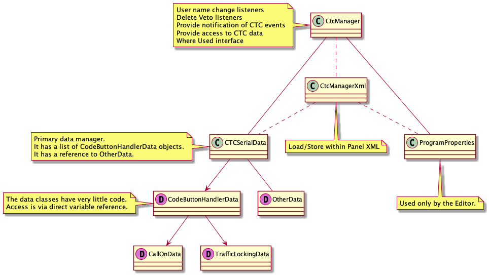

CTC Package Info

The CTC system provides the ability to create and run prototypical CTC dispatching.

The data is stored in the standard PanelPro xml files.

The data classes have references to JMRI beans.  There are 3 CTC NBH classes (NBHSensor, NBHSignal, NBHTurnout) which act as wrappers to the
NamedBeanHandles for the JMRI NamedBeans.  The NBH classes encapsulate the NamedBeanHandles to make program access easier by handling
exceptions, implementing try/catch, etc.

NBH Rules:
- A NBH is created once for each JMRI object using its NameBeanHandle.
- The name and resulting NBH are stored in a HashMap in CtcManager.
- Program references will use the stored NBH.
- Names as Strings are not stored except by the XML store process.
- Dummy NBH references are created for empty bean references.
  - These are not included in the NBH maps.
  - These provide entries that always return an empty string for **getHandleName()** and prevent null pointer exceptions.
  - When a new NBH is selected/created, the dummy NBH reference will be replaced.
- Each time a NBH is obtained, a check will be made for bean renames at the JMRI level.  If so, a new entry will be added using the same target NBH.
- Reference changes made by the Editor will not be reflected in the run-time.  A run-time restart will be required to pick up the changes.
- **OtherData** and **CodeButtonHandlerDataRoutines** create first level default NBH objects, including 7 dummy objects.
- Other NBH entries are created as needed.

