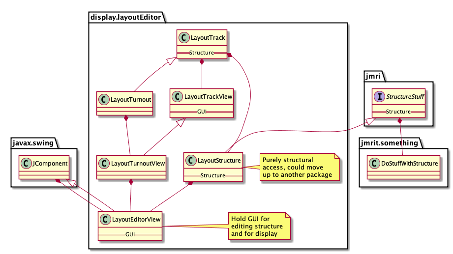

This is a fast-evolving list of items for the restructuring of the display.layoutEditor package. 
It's in no particular order, items are removed as done, so please don't consider it documentation.

----
## Development Tags
 - LE-MVC-2 M-V split in place, passing tests
 -          Reducing duplicate code and redirects; passing tests, Javadoc warnings present
 - LE-MVC-3 More reduction of duplication and redirects; tests clean
 - LE-MVC-4 Introduce LayoutModels interface; tests, Javadoc, warnings clean
 
 Next:
 - LE-MVC-5 [X] Load/Store via *ViewXml; [ ] get LayoutTrack clean of geometry (i.e. no *View referrals in model classes)

## Development Branches
 - LE-move-content-MVC-2-draws - pause point, (appears to) draw test layouts properly (tagged as LE-MVC-2 M-V)
 - LE-move-content-MVC-working-on-3 (tagged as LE-MVC-3)
 - LE-move-content-MVC-working-on-4 (tagged as LE-MVC-4)
 - LE-move-content-MVC-working-on-5 - merged to Oct 26, 2020 master
 
 - LE-MVC-head - built from latest dev branch above for [Jenkins build](https://builds.jmri.org/jenkins/job/testreleases/job/layouteditor/)
----

## MVC work

 - [X] Make up and check a test panel for all 8 track directions (NORTH, NORTH_EAST, etc)
 - [ ] Make up and check an extensive Turnout test panel - rotate, scale, translate plus rays
 - [ ] Make up and check an extensive Slip test panel - rotate, scale, translate plus rays 

- [X] Turntable Ray display
  - [ ] Turntable ray location for information split between topo and View classes; add decorator in view.

- [ ] Spotbugs - do getTurnout, getLayoutBlock, getLayoutBlockB, etc _effectively_ never return null due to usage? In certain cases?
  - [ ]if so, consider documenting that and protecting with asserts
            (assert before a _later_ use doesn't protect against NP warnings)

- [X] mainline in geometry classes (inc base clases, *Xml)
- [X] hidden in View
- [X] flip in View
- [ ] center in View
  - [ ] Move geometric direction and distance to (plugin in) LayoutModels 
            result = Path.computeDirection(getCoordsCenter(), p1);  // has a reference to center we need to understand
  
- [ ] Decorations only in View
    - [ ] PositionablePoint.setTypeEndBumper(), .setTypeEdgeConnector(), .setTypeEdgeConnector() seem to need to be in both model and view
        - [ ] View should _invoke_ Model for relevent parts
        - [ ] document use pattern for both Model and View methods
        - [ ] make sure being consistently called
    - [ ] arrowstyle only in View
        =========>  arrows include connectivity, will need additional work
        - [ ]  see commented out areas in PositionablePoint; need to be handled in View? Via view accessor?
    - [X] bridge only in View
    - [X] tunnel only in View
    - [ ] bumpers only in View

- [X] create popup et al (inc member vars) in view
- [ ] Turnout state in connectivity
- [ ] Block and connectivity checks to, well, connectivity

- [ ] The `*View` classes load a reference to a new `*Editor` in ctor; this needs to be shared or deferred as very big
         editor = new jmri.jmrit.display.layoutEditor.LayoutEditorDialogs.LayoutDoubleSlipEditor(layoutEditor);
- [ ] LayoutEditor.setTurnoutName(@Nonnull), .setSecondTurnout(@Nonnull): Very inconsistent use with "" or null, need to clean up 100%
    - [ ] who uses it through View? Should it be through view?

Go through and confirm individually:

 - [X] Remove view variables from Model classes 
        
 - [ ] Remove swing/AWT code from Model classes
        LayoutSlip - TurnoutState internal class uses JComboBox, is present in both LayoutSlip and LayoutSlipView

 - [ ] LayoutTurnout & LayoutTurnoutView setTrackSegmentBlock(..) is a bad split implementation, needs to be redone into parts

 - [ ] Remove topology variables from View (decide which are references via forwarding, and which require getTrack-style access; be consistent, document decisions!)
        LayoutTrack LayoutTurntable LevelXing  
        PositionablePoint
            reCheckBlockBoundary, removeSML et al
        TrackSegment 
        LayoutTurnout - Ray class (see below)
        LayoutWye 
        LayoutXOver

 - [ ] There should be no duplicate code between model and view; only one place or the other (referring V -> M OK in some cases)
        LayoutTrack LayoutTurntable LevelXing  PositionablePoint TrackSegment 
        LayoutTurnout LayoutWye LayoutLHTurnout LayoutRHTurnout 
        LayoutSlip LayoutSingleSlip LayoutDoubleSlip 
        LayoutXOver LayoutDoubleXOver LayoutLHXOver LayoutRHXOver
        
 - [ ] LayoutTrack holds LayoutModels ref, not LayoutEditor
            models.provideLayoutBlock(name) should be in LayoutModels (Blocks are eventually a model type, not a view type)
            LayoutEditor.getAffectedBlock should be methods in the LayoutTrack tree
            LayouEditor.getFinder().uniqueName("EB", 1)   should be directly in LayoutModels
            
 - [ ] Load & Store: TrackSegmentViewXml et al storing as  class="TrackSegmentView" to ease file comparison & for compatibility; change back after figuring out compatibility
 - load with specific view
        LayoutTrack LayoutTurntable LevelXing  PositionablePoint TrackSegment 
        LayoutTurnout LayoutWye LayoutLHTurnout LayoutRHTurnout 
        LayoutSlip LayoutSingleSlip LayoutDoubleSlip 
        LayoutXOver LayoutDoubleXOver LayoutLHXOver LayoutRHXOver
 - [ ] store from specific view
        LayoutTrack LayoutTurntable LevelXing  PositionablePoint TrackSegment 
        LayoutTurnout LayoutWye LayoutLHTurnout LayoutRHTurnout 
        LayoutSlip LayoutSingleSlip LayoutDoubleSlip 
        LayoutXOver LayoutDoubleXOver LayoutLHXOver LayoutRHXOver

 - [x] Check all ctors handling arguments, storage properly (paired objects for now)

 - [X] Editor creates them the right way (addLayoutTurnout, addLayoutSlip, etc in LE)

 - [ ] Complete head comments
        LayoutTrack LayoutTurntable LevelXing  PositionablePoint TrackSegment 
        LayoutTurnout LayoutWye LayoutLHTurnout LayoutRHTurnout 
        LayoutSlip LayoutSingleSlip LayoutDoubleSlip 
        LayoutXOver LayoutDoubleXOver LayoutLHXOver LayoutRHXOver

 - [ ] Make a final pass to get rid of commented methods (i.e. from migration)
        LayoutTrack LayoutTurntable LevelXing  PositionablePoint TrackSegment 
        LayoutTurnout LayoutWye LayoutLHTurnout LayoutRHTurnout 
        LayoutSlip LayoutSingleSlip LayoutDoubleSlip 
        LayoutXOver LayoutDoubleXOver LayoutLHXOver LayoutRHXOver

 
Does getLayoutConnectivity() in LayoutTurnout, LayoutSlip do what the original code did?
    Need some real test cases.
 
## once moved to View, break down to subclasses to removing dynamic typing

 - move typed code down from:
        LayoutTrack LayoutTurntable LevelXing  PositionablePoint TrackSegment 
        LayoutTurnout
        LayoutSlip
        LayoutXOver
        
 - lots of messages in place for bad routine; some throw IllegalArgumentException, force out by compilation checks
 
---

Tests slow because LayoutEditor ctor creates Catalog, doing a lot of I/O; migrate tests to LayoutModels
```
	at com.sun.imageio.spi.InputStreamImageInputStreamSpi.createInputStreamInstance(InputStreamImageInputStreamSpi.java:69)
	at javax.imageio.ImageIO.createImageInputStream(ImageIO.java:357)
	at jmri.jmrit.catalog.NamedIcon.<init>(NamedIcon.java:98)
	at jmri.jmrit.display.layoutEditor.MultiIconEditor.setIcon(MultiIconEditor.java:42)
	at jmri.jmrit.display.layoutEditor.LayoutEditorToolBarPanel.setupComponents(LayoutEditorToolBarPanel.java:455)
```

- [ ] SignallingGuiTools is invoked from LayoutTurnout and subclasses

---

Started to switch to LayoutModels from LayoutEditor
 - [ ] Change the LayoutTrack ctor and member value, then flush out needed routines to add
    - [ ] getLayoutConnectivity should defer to LayoutModels for direction, not just getCoord
    - [ ] getCoord as a bare behavior should not be in LayoutModels
    - [ ] LayoutModels shouldn't provide Views (may need another interface for those?)
 - [ ] Change the tests to no longer use LayoutEditor, hence being faster (and no longer check headless)
        LayoutTrack LayoutTurntable LevelXing  PositionablePoint TrackSegment 
        LayoutTurnout LayoutWye LayoutLHTurnout LayoutRHTurnout 
        LayoutSlip LayoutSingleSlip LayoutDoubleSlip 
        LayoutXOver LayoutDoubleXOver LayoutLHXOver LayoutRHXOver
---

 [ ]No dispose() in Model classes; should there be remove() in View classes?

Concerned over e.g.  `getConnect2() == myTrk` as code transitions LayoutTrack -> LayoutTrackView. 
 = [ ] Change to .equals()
 - [ ] Provide an equals that will take either for now. i.e. View.equals(Trk) compares the internal track, as does Trk.equals(View)
 
 Also need a solution and tests for `getConnect().callViewMethod()`; do these
 need to move up? How?
 
---

Added 'LayoutEditorAuxTools getLEAuxTools()' (which has state) to LayoutModels - what's up with that state? Really global?

Direct access to LayoutEditorFindItems(LayoutModels) by constructing one where needed. The LayoutModels arg is for access to tracks et al; create via InstanceManager? Put in calls?

This (from TrackSegment) shows that LayoutConnectivity has a "direction" from the screen coordinates; is that a real thing? How used?

```
    lc = new LayoutConnectivity(lb1, lb2);
    lc.setConnections(this, lt, type1, null);
    lc.setDirection(Path.computeDirection(
            layoutEditor.getCoords(getConnect2(), type2),
            layoutEditor.getCoords(getConnect1(), type1)));
```

---

It's not "geometry" or "geometrical" it's connectivity or topology
There are _two_ geometries:  Layout and Screen. There can't be any clean correspondence. 
as people lay out their layout on separate models.  (Another demo of the shortage of single-meaning words)

---
   
Move list management entirely out of LayoutManager to a LayoutModels interface as a first step toward
a separate central repository (also accessible via InstanceManager)
- [X] Interface and scaffold present
- [ ] Added to LayoutTrack and all children (rename layoutEditor member)
- [ ] Added to LayoutTrack tests (instead of LayoutEditor layoutEditor)

The *View classes might want access to a JPanel for e.g. displaying a JDialog, how handle? Inject?

---

Add View ctors that (because it's not given a Track object) knows to create the
track object

 - [ ] LayoutEditor#add of just View pulls Track (but don't have add(LayoutTrack) without View)
 
--- 


Eventually, *View classes should receive a reference to the *ViewContext object(s) and
use that as an accessor instead of the LayoutEditor reference.

Start by giving LayoutEditor an Interface, and passing that.

---

Where do the PositionablePoint editors for End Bumper, etc live? they're not really editors: From Dave Sand:

> The Set items call LayoutEditorTools.  The Edit Link shows a small dialog to select the neighbor panel and block.
> 
> While each one has specific behaviors,  the ability to change the type is handy when creating/modifying track plans.  
> 
> Making them subclasses would simplify the showPopup method but makes the type change more difficult since it 
> requires an object swap (unless there is a Java trick that I don't know).

---

These are kept as private variables with accessors in LayoutEditor, but their defaults come from LayoutTurnout.
The LayoutEditor references seem to be the only ones

```
LayoutEditor
    // turnout size parameters - saved with panel
    private  double turnoutBX = LayoutTurnout.turnoutBXDefault; // RH, LH, WYE
    private  double turnoutCX = LayoutTurnout.turnoutCXDefault;
    private  double turnoutWid = LayoutTurnout.turnoutWidDefault;
    private  double xOverLong = LayoutTurnout.xOverLongDefault; // DOUBLE_XOVER, RH_XOVER, LH_XOVER
    private  double xOverHWid = LayoutTurnout.xOverHWidDefault;
    private  double xOverShort = LayoutTurnout.xOverShortDefault;
    private  boolean useDirectTurnoutControl = false; // Uses Left click for closing points, Right click for throwing.

LayoutTurnout
    // program default turnout size parameters
    public static final double turnoutBXDefault = 20.0;  // RH, LH, WYE
    public static final double turnoutCXDefault = 20.0;
    public static final double turnoutWidDefault = 10.0;
    public static final double xOverLongDefault = 30.0;   // DOUBLE_XOVER, RH_XOVER, LH_XOVER
    public static final double xOverHWidDefault = 10.0;
    public static final double xOverShortDefault = 10.0;
```
---

LayoutEditorComponent support of LayoutShapes, Memories, Blocks, etc as future problem
```
        layoutEditor.getLayoutShapes()
```
 
LayoutEditorComponent.drawTrackSegmentInProgress still uses LayoutTrack not LayoutTrackView
    but what does it actually do? calls to LayoutTrack.highlightUnconnected(..) in two forms

---

getId vs getName why? getName (257) much more common than getId (35), but is it right?
getId but setIdent?

```
% grep -r 'String getName\(\)' java/src/jmri/jmrit/display/layoutEditor/
java/src/jmri/jmrit/display/layoutEditor//LayoutTrackDrawingOptions.java:    public String getName() {
java/src/jmri/jmrit/display/layoutEditor//LayoutShape.java:    public String getName() {
java/src/jmri/jmrit/display/layoutEditor//LayoutEditor.java:        public String getName() {
java/src/jmri/jmrit/display/layoutEditor//LayoutTrack.java:    final public String getName() {

% grep -r 'String getId\(\)' java/src/jmri/jmrit/display/layoutEditor/
java/src/jmri/jmrit/display/layoutEditor//LayoutBlock.java:    public String getId() {
java/src/jmri/jmrit/display/layoutEditor//LayoutTrack.java:    final public String getId() {
```

---

XML migration and Grand Rename
 - Original store/load from LayoutTrack* names
 
 - This was moved to store/load LayoutTrack* and LayoutTrackView* objects via LayoutTrackViewXml* classes and jmri/configurexml/ClassMigration.properties

 - The long-term is to rename the LayoutTrack* classes to LayoutTrackModel* classes, which 
   - allows those to be directly and natively stored/loaded via LayoutTrackModelXml* and LayoutTrackViewXml*configXML classes
   - allows leaving (really, renameing the existing LayoutTrack*) LayoutTrackXml* classes for reading old files

---

Structural navigation issue that has to eventually be resolved:

A LayoutTrackView-subclass object Xv has a LayoutTrack Xt. 
Xt is linked via the usual connection mechanism to Yt, which has a view Tv.
Xa wants the coordinates of that far end, which it needs to get from Yv

Right now, that goes through the Map<LayoutTrack, LayoutTrackView> in a LayoutEditor
object held by Xv from it's construction time. 
 - That forces a 1-1 model-view connection within a LayoutEditor object; not OK in long term

Because navigation is _really_ spread around, this adds more requirements to pass around and 
hold a LayoutEditor reference, which is hard.  And the LayoutEditor class has a _lot_ of duties.

Consider the Swing approach, where things are held within collections that can he navigated
up/down/sideways rather than a common map.

 - [ ] should getLayoutTurnout() et al be public (getModel()?)
 - [ ] add a pointer LayoutTrack -> to avoid lookup?
 
---

## Code Pushes

 - Operational code in the LayoutTrack tree needs to be pushed up and down.

    isDisconnected in LayoutTrack (base) and PositionablePoint (subclass) seem very different;
    do they actually do the same thing?  Want to make one final implementation if possible.
    

- setConnection is similar in 
    LayoutTurnout, LayoutSlip, LevelXing
    
- Why is this considered common code by CI?

    import static java.lang.Float.POSITIVE_INFINITY; 
    

## Further items

 - Role of LayoutShape  (handled in LayoutEditorComponent similar to i.e. LayoutTracks, needs a view? but they're _shapes_)
 
## Minor Cleanups 
 - Sort out comments at the top of LayoutTrack & subclasses
 - Run a cleanup on imports via NetBeans; you've left quite a few behind...

---

LayoutEditorViewContext:  Move the setters to a subclass, allowing separation of a read-only interface for most
uses.  (Members final, but not class? Make the setters an internal class, with both final?)

---

LayoutTrackDrawingOptions holds things like ballast color, etc.
Persisted by configurexml/LayoutTrackDrawingOptionsXml.java
Accessed and maintained by LayoutEditor.java
Accessed by LayoutEditor, maybe set?
Edited by LayoutEditorDialogs/LayoutTrackDrawingOptionsDialog
    Options -> Track Options -> Set Track Options that opens a window
There's also a Options -> Turnout Options that says in a sub menu

---
 
This needs to get hooked up properly:

```
    [javac] /Users/jake/Documents/Trains/JMRI/projects/JMRI/java/src/jmri/jmrit/display/layoutEditor/LayoutEditorChecks.java:378: error: cannot find symbol
    [javac]             layoutEditor.getLayoutTrackEditors().editLayoutTrack(layoutTrack);
    [javac]                         ^
    [javac]   symbol:   method getLayoutTrackEditors()
    [javac]   location: variable layoutEditor of type LayoutEditor
```

---

Way too many calls to repaint, particularly during loading.  Add a global "wait for later", perhaps protected by a keep-alive (or set a 'no repaint-before' timer)

   
---

 Duplicate runs of tests in LayoutTurnoutTest because it's inherited by lots. Break them up?
 
 We're now creating a LayoutEditor for each test in some classes (instead of sharing across tests) to reset it's addTrk(..) contents.  Slow...
 
---

About writing out the image files in tests:

 - Add a control property for writing out the image files in 
``./runtest.csh java/test/jmri/jmrit/display/layoutEditor/LoadAndStoreTest`

 - Drop status output to System.err

 - Consider moving the write up for other classes once it's controlled.

---

 TrackSegment HIDECON as an EnumSet
 https://docs.oracle.com/javase/7/docs/api/java/util/EnumSet.html
 
``` 
     public enum Style {
        BOLD, ITALIC, UNDERLINE, STRIKETHROUGH
    }

    public static void main(String[] args) {
        final EnumSet<Style> styles = EnumSet.noneOf(Style.class);
        styles.addAll(EnumSet.range(Style.BOLD, Style.STRIKETHROUGH)); // enable all constants
        styles.removeAll(EnumSet.of(Style.UNDERLINE, Style.STRIKETHROUGH)); // disable a couple
        assert EnumSet.of(Style.BOLD, Style.ITALIC).equals(styles); // check set contents are correct
        System.out.println(styles);
    }
```    

```
public enum Flag {
    UPPERCASE, REVERSE, FULL_STOP, EMPHASISE;

    public static final EnumSet<Flag> ALL_OPTS = EnumSet.allOf(Flag.class);
}


    if (flags.contains(Flag.UPPERCASE)) value = value.toUpperCase();

 EnumSet.of(Flag.UPPERCASE))
 EnumSet.of(Flag.FULL_STOP, Flag.EMPHASISE)
```

--- 

 % grep "nothing to see" *.java  (Multiple copies removed below)
LayoutEditorChecks.java:                //nothing to see here... move along...
LayoutTurntable.java:            // nothing to see here, move along...
LevelXing.java:        // nothing to see here... move along...
PositionablePoint.java:        //nothing to see here... move along...
TrackSegment.java:        //nothing to see here, move along
TrackSegment.java:        //nothing to see here, move along

---

Fix `//([a-zA-Z])` comments with `// \1`
   
---

Although it's deferring to the View classes mostly, LayoutComponent is
still messing with i.e. isDisabled, isHidden instead of deferring that to the objects
   
---
 
 Might still be enum:
 
```
layoutEditor/blockRoutingTable/LayoutBlockNeighbourTableModel.java:    public static final int NEIGHBOURCOL = 0;
layoutEditor/blockRoutingTable/LayoutBlockNeighbourTableModel.java:    static final int DIRECTIONCOL = 1;
layoutEditor/blockRoutingTable/LayoutBlockNeighbourTableModel.java:    static final int MUTUALCOL = 2;
layoutEditor/blockRoutingTable/LayoutBlockNeighbourTableModel.java:    static final int RELATCOL = 3;
layoutEditor/blockRoutingTable/LayoutBlockNeighbourTableModel.java:    static final int METRICCOL = 4;
layoutEditor/blockRoutingTable/LayoutBlockNeighbourTableModel.java:    static final int NUMCOL = 4 + 1;

layoutEditor/blockRoutingTable/LayoutBlockThroughPathsTableModel.java:    public static final int SOURCECOL = 0;
layoutEditor/blockRoutingTable/LayoutBlockThroughPathsTableModel.java:    static final int DESTINATIONCOL = 1;
layoutEditor/blockRoutingTable/LayoutBlockThroughPathsTableModel.java:    static final int ACTIVECOL = 2;
layoutEditor/blockRoutingTable/LayoutBlockThroughPathsTableModel.java:    static final int NUMCOL = 2 + 1;

layoutEditor/blockRoutingTable/LayoutBlockRouteTableModel.java:    public static final int DESTCOL = 0;
layoutEditor/blockRoutingTable/LayoutBlockRouteTableModel.java:    static final int NEXTHOPCOL = 1;
layoutEditor/blockRoutingTable/LayoutBlockRouteTableModel.java:    static final int HOPCOUNTCOL = 2;
layoutEditor/blockRoutingTable/LayoutBlockRouteTableModel.java:    static final int DIRECTIONCOL = 3;
layoutEditor/blockRoutingTable/LayoutBlockRouteTableModel.java:    static final int METRICCOL = 4;
layoutEditor/blockRoutingTable/LayoutBlockRouteTableModel.java:    static final int LENGTHCOL = 5;
layoutEditor/blockRoutingTable/LayoutBlockRouteTableModel.java:    static final int STATECOL = 6;
layoutEditor/blockRoutingTable/LayoutBlockRouteTableModel.java:    static final int VALIDCOL = 7;
layoutEditor/blockRoutingTable/LayoutBlockRouteTableModel.java:    static final int NUMCOL = 7 + 1;
```

Note bits:
```
layoutEditor/LayoutBlock.java:    public static final int RESERVED = 0x08;
layoutEditor/LayoutBlock.java:    final static int ADDITION = 0x00;
layoutEditor/LayoutBlock.java:    final static int UPDATE = 0x02;
layoutEditor/LayoutBlock.java:    final static int REMOVAL = 0x04;
```

Note bits, with an odd choice of NONE - confined to Layout Block, make private? 
```
layoutEditor/LayoutBlock.java:    final static int RXTX = 0x00;
layoutEditor/LayoutBlock.java:    final static int RXONLY = 0x02;
layoutEditor/LayoutBlock.java:    final static int TXONLY = 0x04;
layoutEditor/LayoutBlock.java:    final static int NONE = 0x08;

layoutEditor/ConnectivityUtil.java:    public static final int OVERALL = 0x00;  (Connected to Section.java)
layoutEditor/ConnectivityUtil.java:    public static final int CONTINUING = 0x01;
layoutEditor/ConnectivityUtil.java:    public static final int DIVERGING = 0x02;
```

Note the following values repeat. Two Enums? Try and see if compiles.
```
layoutEditor/LayoutConnectivity.java:    final public static int NONE = 0;
layoutEditor/LayoutConnectivity.java:    final public static int XOVER_BOUNDARY_AB = 1;  // continuing
layoutEditor/LayoutConnectivity.java:    final public static int XOVER_BOUNDARY_CD = 2;  // continuing
layoutEditor/LayoutConnectivity.java:    final public static int XOVER_BOUNDARY_AC = 3;  // xed over
layoutEditor/LayoutConnectivity.java:    final public static int XOVER_BOUNDARY_BD = 4;  // xed over
layoutEditor/LayoutConnectivity.java:    final public static int XOVER_BOUNDARY_AD = 1;  // continuing (slips)
layoutEditor/LayoutConnectivity.java:    final public static int XOVER_BOUNDARY_BC = 2;  // continuing (slips)
```

The following are bits, but there's no indication they are ever or'd:
```
layoutEditor/LayoutTurnout.java:    public static final int STATE_AC = 0x02;
layoutEditor/LayoutTurnout.java:    public static final int STATE_BD = 0x04;
layoutEditor/LayoutTurnout.java:    public static final int STATE_AD = 0x06;
layoutEditor/LayoutTurnout.java:    public static final int STATE_BC = 0x08;
```

These bits are or'd, see tests
```
layoutEditor/TrackSegment.java:    public static final int SHOWCON = 0x01;
layoutEditor/TrackSegment.java:    public static final int HIDECON = 0x02;     // flag set on a segment basis.
layoutEditor/TrackSegment.java:    public static final int HIDECONALL = 0x04;  // Used by layout editor for hiding all
```

---

An example of a private enum that's not, from ConnectivityUtil:
```
    private final int TRACKNODE_CONTINUING = 0;
    private final int TRACKNODE_DIVERGING = 1;
    private final int TRACKNODE_DIVERGING_2ND_3WAY = 2;
```
Note private. But Section.java has lots of lines like:
```
                    tn = cUtil.getNextNode(tn, 0);
```
Where that "0" is really TRACKNODE_CONTINUING (by the argument). One way to protect is
to provide a getNextNode that has one argument, i.e. assumes the  TRACKNODE_CONTINUING

---

 mainline track width, side track width are in both LayoutEditorViewContext and LayoutTrackDrawingOptions.
 Also, why are they floats?  (What's loaded and stored? Is there any calcuation that can make a
 non-integer value?)

---

To store separately
 - cp *ViewXml  to *Xml to _read_ (but not write) old format with both combined
    - update from java/src/jmri/configurexml/ClassMigration.properties by removing *View lines
 - make a new *ModelXml that stores the model; drop that info from *View
 - figure out who should trigger store of Model, make LayoutModels as a single registered object?

---

Outside its own package, "jmri.jmrit.display.layoutEditor" appears in (with counts):

```
   2 java/src/apps/Apps.java
   1 java/src/apps/AppsBase.java
   
   1 java/src/jmri/BlockManager.java  
                (ref and use jmri.jmrit.display.layoutEditor.BlockValueFile)
                
  11 java/src/jmri/Section.java
   2 java/src/jmri/SectionManager.java

   2 java/src/jmri/SignalMastLogic.java  
                import jmri.jmrit.display.layoutEditor.LayoutBlock;
                    public void setFacingBlock(LayoutBlock facing);
                    public LayoutBlock getFacingBlock();
                    public LayoutBlock getProtectingBlock(SignalMast destination);
                    public LinkedHashMap<Block, Integer> setupLayoutEditorTurnoutDetails(List<LayoutBlock> blks, SignalMast destination);

                import jmri.jmrit.display.layoutEditor.LevelXing;
                    public void removeConflictingLogic(SignalMast sm, LevelXing lx);
                    public void setConflictingLogic(SignalMast sm, LevelXing lx);
                    
   1 java/src/jmri/SignalMastLogicManager.java       
                public void discoverSignallingDest(@Nonnull SignalMast source, @Nonnull LayoutEditor layout) throws JmriException;

   1 java/src/jmri/Transit.java
                public int checkSignals(LayoutEditor panel) {
                public int validateConnectivity(LayoutEditor panel) {

   6 java/src/jmri/configurexml/ClassMigration.properties
   1 java/src/jmri/configurexml/LoadXmlConfigAction.java
   2 java/src/jmri/implementation/DefaultCabSignal.java
  14 java/src/jmri/implementation/DefaultSignalMastLogic.java
   2 java/src/jmri/jmrit/beantable/BeanTableDataModel.java
   3 java/src/jmri/jmrit/beantable/Maintenance.java
   1 java/src/jmri/jmrit/beantable/SectionTableAction.java
   1 java/src/jmri/jmrit/beantable/SignalMastLogicTableAction.java
   2 java/src/jmri/jmrit/beantable/beanedit/BeanEditAction.java
   2 java/src/jmri/jmrit/beantable/beanedit/BlockEditAction.java
   1 java/src/jmri/jmrit/blockboss/BlockBossFrame.java              - Just an @see?
   2 java/src/jmri/jmrit/dispatcher/AutoActiveTrain.java
   3 java/src/jmri/jmrit/dispatcher/AutoAllocate.java
   5 java/src/jmri/jmrit/dispatcher/AutoTurnouts.java
   2 java/src/jmri/jmrit/dispatcher/DispatcherFrame.java
   1 java/src/jmri/jmrit/dispatcher/OptionsFile.java
   1 java/src/jmri/jmrit/dispatcher/OptionsMenu.java
   2 java/src/jmri/jmrit/display/MemoryIcon.java
   1 java/src/jmri/jmrit/display/NewPanelAction.java
   2 java/src/jmri/jmrit/display/PanelMenu.java
   3 java/src/jmri/jmrit/display/SignalMastIcon.java
   2 java/src/jmri/jmrit/display/configurexml/BlockContentsIconXml.java
   2 java/src/jmri/jmrit/display/configurexml/MemoryIconXml.java
   1 java/src/jmri/jmrit/entryexit/AddEntryExitPairAction.java
   1 java/src/jmri/jmrit/entryexit/AddEntryExitPairFrame.java
   7 java/src/jmri/jmrit/entryexit/AddEntryExitPairPanel.java
  14 java/src/jmri/jmrit/entryexit/DestinationPoints.java
   9 java/src/jmri/jmrit/entryexit/EntryExitPairs.java
   3 java/src/jmri/jmrit/entryexit/ManuallySetRoute.java
   6 java/src/jmri/jmrit/entryexit/PointDetails.java
   2 java/src/jmri/jmrit/entryexit/Source.java
   1 java/src/jmri/jmrit/entryexit/configurexml/EntryExitPairsXml.java
   2 java/src/jmri/jmrit/signalling/SignallingPanel.java
   2 java/src/jmri/jmrit/signalling/SignallingSourcePanel.java
   1 java/src/jmri/jmrit/whereused/WhereUsedCollectors.java
   4 java/src/jmri/managers/DefaultSignalMastLogicManager.java
   1 java/src/jmri/script/JmriScriptEngineManager.java
   2 java/src/jmri/server/json/layoutblock/JsonLayoutBlockHttpService.java
   2 java/src/jmri/server/json/layoutblock/JsonLayoutBlockSocketService.java
   1 java/src/jmri/server/json/util/JsonUtilHttpService.java
   1 java/src/jmri/web/servlet/panel/LayoutPanelServlet.java
   
   1 java/test/jmri/InstanceManagerTest.java
   1 java/test/jmri/configurexml/LoadAndStoreTestBase.java
   4 java/test/jmri/implementation/DefaultCabSignalIT.java
   2 java/test/jmri/jmrit/beantable/BlockTableActionTest.java
   2 java/test/jmri/jmrit/display/SensorIconWindowTest.java
   3 java/test/jmri/jmrit/display/SignalSystemTest.java
   2 java/test/jmri/jmrit/display/TurnoutIconWindowTest.java
   1 java/test/jmri/jmrit/display/configurexml/LevelXingXmlTest.java
   1 java/test/jmri/jmrit/entryexit/AddEntryExitPairActionTest.java
   1 java/test/jmri/jmrit/entryexit/AddEntryExitPairPanelTest.java
   2 java/test/jmri/jmrit/entryexit/DestinationPointsTest.java
   2 java/test/jmri/jmrit/entryexit/EntryExitPairsTest.java
   2 java/test/jmri/jmrit/entryexit/EntryExitTestTools.java
   1 java/test/jmri/jmrit/entryexit/ManuallySetRouteTest.java
   3 java/test/jmri/jmrit/entryexit/PointDetailsTest.java
   3 java/test/jmri/jmrit/entryexit/SourceTest.java
   2 java/test/jmri/server/json/layoutblock/JsonLayoutBlockSocketServiceTest.java
   1 java/test/jmri/server/json/util/JsonUtilSocketServiceTest.java
   1 java/test/jmri/util/JUnitUtil.java
```


---
 
 The LayoutTrack classes ($LETRK) use these from LayoutEditor
```
 layoutEditor.setDirty();
 layoutEditor.redrawPanel();   {just calls repaint?} see .paintTargetPanel abstract in ../Editor; LayoutEditor extends PanelEditor
 layoutEditor.repaint()
 layoutEditor.getLETools(). {lots of stuff}
 layoutEditor.getLEAuxTools(). {lots of stuff}
 layoutEditor.getFinder().{lots of stuff}
  layoutEditor.getLayoutEditorToolBarPanel()
  
  layoutEditor.setShowAlignmentMenu(popup)
  layoutEditor.isEditable()
  layoutEditor.getZoom()
  layoutEditor.getTargetPanel()
  
  layoutEditor.circleDiameter
  layoutEditor.circleRadius
  
 layoutEditor.isTurnoutDrawUnselectedLeg
 
 layoutEditor.getXOverLong()
 layoutEditor.getXOverHWid()
 layoutEditor.getXOverShort()
 layoutEditor.setXOverLong
 layoutEditor.setXOverHWid
 layoutEditor.setXOverShort
```
 The above are presisted to XML.  LayoutTurnout#setUpDefaultSize sets them from a specific
 turnout, depending on type, and is only invoked from "Use Size as Default" selection in 
 interface.  Also, are the if statements in setUpDefaultSize structured right?
```
 layoutEditor.isTurnoutFillControlCircles
 LayoutEditor.SIZE * layoutEditor.getTurnoutCircleSize();
 
 layoutEditor.layoutEditorControlRectAt(getCoordsA())
 layoutEditor. setSelectionRect
 
 layoutEditor.getXScale()
 layoutEditor.getYScale()
 
 layoutEditor.setTurnoutBX
 layoutEditor.setTurnoutCX
 layoutEditor.setTurnoutWid
 
 layoutEditor.getFinder()
 
layoutEditor.removeLayoutSlip
layoutEditor.removeLayoutTurnout
if (canRemove() && layoutEditor.removeLevelXing(LevelXing.this))

layoutEditor.setLink
layoutEditor.addAnchor

layoutEditor.getLayoutTrackDrawingOptions()

layoutEditor.getLayoutTrackEditors()
layoutEditor.getLayoutTracks()

layoutEditor.selectedObject
layoutEditor.prevSelectedObject
```
To understand the above, probably have to move the listener definitions out.
```
% grep Listener $LETRK | awk '{print $1}' | uniq -c
   8 LayoutTurntable.java:
   1 LevelXing.java:
   1 PositionablePoint.java:import
  21 PositionablePoint.java:
  49 TrackSegment.java:
  13 LayoutTurnout.java:
  11 LayoutSlip.java:
```
Mostly addActionListener via ()->, some named listeners, some addPropertyChangeListener

---

This is in Section.java, should be in somewhere in the layoutManager package under navigation section

```
    private LayoutTurnout getLayoutTurnoutFromTurnoutName(String turnoutName, LayoutEditor panel) {
        Turnout t = InstanceManager.turnoutManagerInstance().getTurnout(turnoutName);
        if (t == null) {
            return null;
        }
        for (LayoutTurnout lt : panel.getLayoutTurnouts()) {
            if (lt.getTurnout() == t) {
                return lt;
            }
        }
        return null;
    }
```

---

getBlockName not in LayoutTrack, perhaps because there are two forms of internal variable:
LayoutTrack:
    protected NamedBeanHandle<LayoutBlock> namedLayoutBlockA = null;
 (There's a getBlockBName, getBlockCName, D but just getBlock for A in LayoutTurnout)
 
 But TrackSegment has it's own getBlockName referencing it's own
     private NamedBeanHandle<LayoutBlock> namedLayoutBlock = null;

Maybe other subclasses?
And the getBlockName code could be simpler, see the getBlock one-line version.

---
 
Example from LayoutEditor
```
        if ((lt.getConnectD() == null) && (lt.isTurnoutTypeXover() || lt.isTurnoutTypeSlip())) {
            if (lt instanceof LayoutSlip) {
                beginHitPointType = HitPointType.SLIP_D;
            } else {
                beginHitPointType = HitPointType.TURNOUT_D;
            }
            dLoc = lt.getCoordsD();
            hitPointCheckLayoutTurnoutSubs(dLoc);
        }
```
Should that be a "getBeginHitPoint"?

(Scan for instanceOf)

---

Example from LayoutEditor  (What's that stuff at the top selecting?)

                case TURNOUT_A:
                case TURNOUT_B:
                case TURNOUT_C:
                case TURNOUT_D:
                case SLIP_A:
                case SLIP_B:
                case SLIP_C:
                case SLIP_D: {
                    LayoutTurnout ft = (LayoutTurnout) foundTrack;
                    addTrackSegment();

                    if ((ft.getTurnoutType() == LayoutTurnout.TurnoutType.RH_TURNOUT) || (ft.getTurnoutType() == LayoutTurnout.TurnoutType.LH_TURNOUT)) {
                        rotateTurnout(ft);
                    }

                    // Assign a block to the new zero length track segment.
                    ft.setTrackSegmentBlock(foundHitPointType, true);
                    break;
                }

What are we _not_ rotating the other types?  Is this a conditional thing somehow?  
(check rotateTurnout method a few lines down which does a similar check and returns, but might be called from elsewhere)

---

java/src/jmri/util/NamedBeanHandleComparator.java prompts some cleanup:
 - to give stable sorting, should this use the bean (reference) name instead of system name?
 - Should/is NamedBeanHandle's name member datam really immutable? Final?
 
---


Figure this one out!  At least part of the comments is wrong...
TrackSegment 436
    /**
     * {@inheritDoc}
     * <p>
     * This implementation returns null because {@link #getConnect1} and
     * {@link #getConnect2} should be used instead.
     */
    //only implemented here to suppress "does not override abstract method " error in compiler
    @Override
    public LayoutTrack getConnection(HitPointType connectionType) throws jmri.JmriException {
        //nothing to see here, move along
        throw new jmri.JmriException("Use getConnect1() or getConnect2() instead.");
    }

(Searching for "nothing to see here" is interesting)

---

There's got to be a better way than all those code replications on connectionA, connectionB, connectionC, connectionD - maybe a group transformation?

Similarly, having connection and a HitPointType as separate is screaming for a combined data type.

---

"version" in LayoutTurnout (and others?) is really another kind of type, as it's used at runtime and load/store
---


LayoutTrackDrawingOptions is mutable and doesn't have a constant hash

---

## Some notes on the Layout Editor migration project 

[from a separate page](migration/MigrationNotes.md) that can easily be dropped later if needed.

Where we are now:


Moving to MVC:


Lift accessor to JMRI package via temporary interface:


Separate out LayoutEditor class to MVC parts:



 --- 
 
 Go through the ExpectedState -> NamedBeanExpectedValue -> NamedBeanExpectedState -> BeanSetting
 hierarchy to add Comparable, @Immutable as possible.  Path should use BeanSetting.compareTo instead of local logic.
 While there, check (and document meaning of!) equals, hashCode
 
 
 
