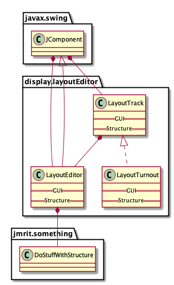

This is a fast-evolving list of items for the restructuring of the display.layoutEditor package. 
It's in no particular order, items are removed as done, so please don't consider it documentation.


----

## MVC work
 -  *View  present and running, now start to move code for those methods
        rename methods left behind to ensure not accessed
 - once moved to View, break down to subclasses to removing dynamic typing

Usages from LayoutTrackView:

```
protected abstract void draw1(Graphics2D g2, boolean isMain, boolean isBlock);

    java/src/jmri/jmrit/display/layoutEditor/LayoutTurnout.java:3442
    java/src/jmri/jmrit/display/layoutEditor/LayoutTurntable.java:1136
    java/src/jmri/jmrit/display/layoutEditor/TrackSegment.java:2295
    java/src/jmri/jmrit/display/layoutEditor/PositionablePoint.java:1760
    java/src/jmri/jmrit/display/layoutEditor/LevelXing.java:1508
    java/src/jmri/jmrit/display/layoutEditor/LayoutSlip.java:1093

    java/src/jmri/jmrit/display/layoutEditor/LayoutEditorChecks.java:379

abstract protected void draw2(Graphics2D g2, boolean isMain, float railDisplacement)

    java/src/jmri/jmrit/display/layoutEditor/LayoutTurnout.java:3781
    java/src/jmri/jmrit/display/layoutEditor/LayoutTurntable.java:1187
    java/src/jmri/jmrit/display/layoutEditor/TrackSegment.java:2328
    java/src/jmri/jmrit/display/layoutEditor/PositionablePoint.java:1768
    java/src/jmri/jmrit/display/layoutEditor/LevelXing.java:1527
    java/src/jmri/jmrit/display/layoutEditor/LayoutSlip.java:1267
    (others inherited)    
    
abstract protected void drawEditControls(Graphics2D g2);

    java/src/jmri/jmrit/display/layoutEditor/LayoutTurnout.java:4511
    java/src/jmri/jmrit/display/layoutEditor/LayoutTurntable.java:1266
    java/src/jmri/jmrit/display/layoutEditor/TrackSegment.java:2385
    java/src/jmri/jmrit/display/layoutEditor/PositionablePoint.java:1789
    java/src/jmri/jmrit/display/layoutEditor/LevelXing.java:1632

   
abstract protected void drawDecorations(Graphics2D g2);
    java/src/jmri/jmrit/display/layoutEditor/LayoutTurnout.java:3436
    java/src/jmri/jmrit/display/layoutEditor/LayoutTurntable.java:1130
    java/src/jmri/jmrit/display/layoutEditor/TrackSegment.java:2431
    java/src/jmri/jmrit/display/layoutEditor/PositionablePoint.java:1754
    java/src/jmri/jmrit/display/layoutEditor/LevelXing.java:1500

    java/src/jmri/jmrit/display/layoutEditor/LayoutEditorChecks.java:379
```

---

Eventually, *View classes should receive a reference to the *ViewContext object(s) and
use that as an accessor instead of the LayoutEditor reference.

---

Where do the PositionablePoint editors for End Bumper, etc live? they're not really editors: From Dave Sand:

> The Set items call LayoutEditorTools.  The Edit Link shows a small dialog to select the neighbor panel and block.
> 
> While each one has specific behaviors,  the ability to change the type is handy when creating/modifying track plans.  
> 
> Making them subclasses would simplify the showPopup method but makes the type change more difficult since it 
> requires an object swap (unless there is a Java trick that I don't know).


---

These are kept as private variables with accessors in LayoutEditor, but their defaults come from LayoutTurnout.
The LayoutEditor references seem to be the only ones

```
LayoutEditor
    // turnout size parameters - saved with panel
    private  double turnoutBX = LayoutTurnout.turnoutBXDefault; // RH, LH, WYE
    private  double turnoutCX = LayoutTurnout.turnoutCXDefault;
    private  double turnoutWid = LayoutTurnout.turnoutWidDefault;
    private  double xOverLong = LayoutTurnout.xOverLongDefault; // DOUBLE_XOVER, RH_XOVER, LH_XOVER
    private  double xOverHWid = LayoutTurnout.xOverHWidDefault;
    private  double xOverShort = LayoutTurnout.xOverShortDefault;
    private  boolean useDirectTurnoutControl = false; // Uses Left click for closing points, Right click for throwing.

LayoutTurnout
    // program default turnout size parameters
    public static final double turnoutBXDefault = 20.0;  // RH, LH, WYE
    public static final double turnoutCXDefault = 20.0;
    public static final double turnoutWidDefault = 10.0;
    public static final double xOverLongDefault = 30.0;   // DOUBLE_XOVER, RH_XOVER, LH_XOVER
    public static final double xOverHWidDefault = 10.0;
    public static final double xOverShortDefault = 10.0;
```
---

LayoutEditorComponent support of LayoutShapes, Memories, Blocks, etc as future problem
```
        layoutEditor.getLayoutShapes()
```
 
LayoutEditorComponent.drawTrackSegmentInProgress still uses LayoutTrack not LayoutTrackView
    but what does it actually do? calls to LayoutTrack.highlightUnconnected(..) in two forms

---

getId vs getName why? getName (257) much more common than getId (35), but is it right?

```
% grep -r 'String getName\(\)' java/src/jmri/jmrit/display/layoutEditor/
java/src/jmri/jmrit/display/layoutEditor//LayoutTrackDrawingOptions.java:    public String getName() {
java/src/jmri/jmrit/display/layoutEditor//LayoutShape.java:    public String getName() {
java/src/jmri/jmrit/display/layoutEditor//LayoutEditor.java:        public String getName() {
java/src/jmri/jmrit/display/layoutEditor//LayoutTrack.java:    final public String getName() {

% grep -r 'String getId\(\)' java/src/jmri/jmrit/display/layoutEditor/
java/src/jmri/jmrit/display/layoutEditor//LayoutBlock.java:    public String getId() {
java/src/jmri/jmrit/display/layoutEditor//LayoutTrack.java:    final public String getId() {
```

---

## Code Pushes

 - Operational code in the LayoutTrack tree needs to be pushed up and down.

    isDisconnected in LayoutTrack (base) and PositionablePoint (subclass) seem very different;
    do they actually do the same thing?  Want to make one final implementation if possible.
    

- setConnection is similar in 
    LayoutTurnout, LayoutSlip, LevelXing
    
- Why is this considered common code by CI?

    import static java.lang.Float.POSITIVE_INFINITY; 
    

## Further items

 - Role of LayoutShape  (handled in LayoutEditorComponent similar to i.e. LayoutTracks, needs a view? but they're _shapes_)
 
## Minor Cleanups 
 - Sort out comments at the top of LayoutTrack & subclasses
 - Run a cleanup on imports via NetBeans; you've left quite a few behind...

---

LayoutEditorViewContext:  Move the setters to a subclass, allowing separation of a read-only interface for most
uses.  (Members final, but not class? Make the setters an internal class, with both final?)

---

LayoutTrackDrawingOptions holds things like ballast color, etc.
Persisted by configurexml/LayoutTrackDrawingOptionsXml.java
Accessed and maintained by LayoutEditor.java
Accessed by LayoutEditor, maybe set?
Edited by LayoutEditorDialogs/LayoutTrackDrawingOptionsDialog
    Options -> Track Options -> Set Track Options that opens a window
There's also a Options -> Turnout Options that says in a sub menu

---
 
This needs to get hooked up properly:

```
    [javac] /Users/jake/Documents/Trains/JMRI/projects/JMRI/java/src/jmri/jmrit/display/layoutEditor/LayoutEditorChecks.java:378: error: cannot find symbol
    [javac]             layoutEditor.getLayoutTrackEditors().editLayoutTrack(layoutTrack);
    [javac]                         ^
    [javac]   symbol:   method getLayoutTrackEditors()
    [javac]   location: variable layoutEditor of type LayoutEditor
```

---

About writing out the image files in tests:

 - Add a control property for writing out the image files in 
``./runtest.csh java/test/jmri/jmrit/display/layoutEditor/LoadAndStoreTest`

 - Drop status output to System.err

 - Consider moving the write up for other classes once it's controlled.

---

 TrackSegment HIDECON as an EnumSet
 https://docs.oracle.com/javase/7/docs/api/java/util/EnumSet.html
``` 
     public enum Style {
        BOLD, ITALIC, UNDERLINE, STRIKETHROUGH
    }

    public static void main(String[] args) {
        final EnumSet<Style> styles = EnumSet.noneOf(Style.class);
        styles.addAll(EnumSet.range(Style.BOLD, Style.STRIKETHROUGH)); // enable all constants
        styles.removeAll(EnumSet.of(Style.UNDERLINE, Style.STRIKETHROUGH)); // disable a couple
        assert EnumSet.of(Style.BOLD, Style.ITALIC).equals(styles); // check set contents are correct
        System.out.println(styles);
    }
```    

```
public enum Flag {
    UPPERCASE, REVERSE, FULL_STOP, EMPHASISE;

    public static final EnumSet<Flag> ALL_OPTS = EnumSet.allOf(Flag.class);
}


    if (flags.contains(Flag.UPPERCASE)) value = value.toUpperCase();

 EnumSet.of(Flag.UPPERCASE))
 EnumSet.of(Flag.FULL_STOP, Flag.EMPHASISE)
```

--- 

 % grep "nothing to see" *.java  (Multiple copies removed below)
LayoutEditorChecks.java:                //nothing to see here... move along...
LayoutTurntable.java:            // nothing to see here, move along...
LevelXing.java:        // nothing to see here... move along...
PositionablePoint.java:        //nothing to see here... move along...
TrackSegment.java:        //nothing to see here, move along
TrackSegment.java:        //nothing to see here, move along

---

Fix `//([a-zA-Z])` comments with `// \1`
   
---
   
   Consider moving list management entirely out of Layout Manager to decrease size & complexity.
   
---

although it's deferring to the View classes mostly, LayoutComponent is
still messing with i.e. isDisabled, isHidden instead of deferring that to the objects
   
---
 
 Might still be enum:
 
```
layoutEditor/blockRoutingTable/LayoutBlockNeighbourTableModel.java:    public static final int NEIGHBOURCOL = 0;
layoutEditor/blockRoutingTable/LayoutBlockNeighbourTableModel.java:    static final int DIRECTIONCOL = 1;
layoutEditor/blockRoutingTable/LayoutBlockNeighbourTableModel.java:    static final int MUTUALCOL = 2;
layoutEditor/blockRoutingTable/LayoutBlockNeighbourTableModel.java:    static final int RELATCOL = 3;
layoutEditor/blockRoutingTable/LayoutBlockNeighbourTableModel.java:    static final int METRICCOL = 4;
layoutEditor/blockRoutingTable/LayoutBlockNeighbourTableModel.java:    static final int NUMCOL = 4 + 1;

layoutEditor/blockRoutingTable/LayoutBlockThroughPathsTableModel.java:    public static final int SOURCECOL = 0;
layoutEditor/blockRoutingTable/LayoutBlockThroughPathsTableModel.java:    static final int DESTINATIONCOL = 1;
layoutEditor/blockRoutingTable/LayoutBlockThroughPathsTableModel.java:    static final int ACTIVECOL = 2;
layoutEditor/blockRoutingTable/LayoutBlockThroughPathsTableModel.java:    static final int NUMCOL = 2 + 1;

layoutEditor/blockRoutingTable/LayoutBlockRouteTableModel.java:    public static final int DESTCOL = 0;
layoutEditor/blockRoutingTable/LayoutBlockRouteTableModel.java:    static final int NEXTHOPCOL = 1;
layoutEditor/blockRoutingTable/LayoutBlockRouteTableModel.java:    static final int HOPCOUNTCOL = 2;
layoutEditor/blockRoutingTable/LayoutBlockRouteTableModel.java:    static final int DIRECTIONCOL = 3;
layoutEditor/blockRoutingTable/LayoutBlockRouteTableModel.java:    static final int METRICCOL = 4;
layoutEditor/blockRoutingTable/LayoutBlockRouteTableModel.java:    static final int LENGTHCOL = 5;
layoutEditor/blockRoutingTable/LayoutBlockRouteTableModel.java:    static final int STATECOL = 6;
layoutEditor/blockRoutingTable/LayoutBlockRouteTableModel.java:    static final int VALIDCOL = 7;
layoutEditor/blockRoutingTable/LayoutBlockRouteTableModel.java:    static final int NUMCOL = 7 + 1;
```

Note bits:
```
layoutEditor/LayoutBlock.java:    public static final int RESERVED = 0x08;
layoutEditor/LayoutBlock.java:    final static int ADDITION = 0x00;
layoutEditor/LayoutBlock.java:    final static int UPDATE = 0x02;
layoutEditor/LayoutBlock.java:    final static int REMOVAL = 0x04;
```

Note bits, with an odd choice of NONE - confined to Layout Block, make private? 
```
layoutEditor/LayoutBlock.java:    final static int RXTX = 0x00;
layoutEditor/LayoutBlock.java:    final static int RXONLY = 0x02;
layoutEditor/LayoutBlock.java:    final static int TXONLY = 0x04;
layoutEditor/LayoutBlock.java:    final static int NONE = 0x08;

layoutEditor/ConnectivityUtil.java:    public static final int OVERALL = 0x00;  (Connected to Section.java)
layoutEditor/ConnectivityUtil.java:    public static final int CONTINUING = 0x01;
layoutEditor/ConnectivityUtil.java:    public static final int DIVERGING = 0x02;
```

Note the following values repeat. Two Enums? Try and see if compiles.
```
layoutEditor/LayoutConnectivity.java:    final public static int NONE = 0;
layoutEditor/LayoutConnectivity.java:    final public static int XOVER_BOUNDARY_AB = 1;  // continuing
layoutEditor/LayoutConnectivity.java:    final public static int XOVER_BOUNDARY_CD = 2;  // continuing
layoutEditor/LayoutConnectivity.java:    final public static int XOVER_BOUNDARY_AC = 3;  // xed over
layoutEditor/LayoutConnectivity.java:    final public static int XOVER_BOUNDARY_BD = 4;  // xed over
layoutEditor/LayoutConnectivity.java:    final public static int XOVER_BOUNDARY_AD = 1;  // continuing (slips)
layoutEditor/LayoutConnectivity.java:    final public static int XOVER_BOUNDARY_BC = 2;  // continuing (slips)
```

The following are bits, but there's no indication they are ever or'd:
```
layoutEditor/LayoutTurnout.java:    public static final int STATE_AC = 0x02;
layoutEditor/LayoutTurnout.java:    public static final int STATE_BD = 0x04;
layoutEditor/LayoutTurnout.java:    public static final int STATE_AD = 0x06;
layoutEditor/LayoutTurnout.java:    public static final int STATE_BC = 0x08;
```

These bits are or'd, see tests
```
layoutEditor/TrackSegment.java:    public static final int SHOWCON = 0x01;
layoutEditor/TrackSegment.java:    public static final int HIDECON = 0x02;     // flag set on a segment basis.
layoutEditor/TrackSegment.java:    public static final int HIDECONALL = 0x04;  // Used by layout editor for hiding all
```

---

An example of a private enum that's not, from ConnectivityUtil:
```
    private final int TRACKNODE_CONTINUING = 0;
    private final int TRACKNODE_DIVERGING = 1;
    private final int TRACKNODE_DIVERGING_2ND_3WAY = 2;
```
Note private. But Section.java has lots of lines like:
```
                    tn = cUtil.getNextNode(tn, 0);
```
Where that "0" is really TRACKNODE_CONTINUING (by the argument). One way to protect is
to provide a getNextNode that has one argument, i.e. assumes the  TRACKNODE_CONTINUING

---

 mainline track width, side track width are in both LayoutEditorViewContext and LayoutTrackDrawingOptions.
 Also, why are they floats?  (What's loaded and stored? Is there any calcuation that can make a
 non-integer value?)

---

Outside its own package, "jmri.jmrit.display.layoutEditor" appears in (with counts):

```
   2 java/src/apps/Apps.java
   1 java/src/apps/AppsBase.java
   
   1 java/src/jmri/BlockManager.java  
                (ref and use jmri.jmrit.display.layoutEditor.BlockValueFile)
                
  11 java/src/jmri/Section.java
   2 java/src/jmri/SectionManager.java

   2 java/src/jmri/SignalMastLogic.java  
                import jmri.jmrit.display.layoutEditor.LayoutBlock;
                    public void setFacingBlock(LayoutBlock facing);
                    public LayoutBlock getFacingBlock();
                    public LayoutBlock getProtectingBlock(SignalMast destination);
                    public LinkedHashMap<Block, Integer> setupLayoutEditorTurnoutDetails(List<LayoutBlock> blks, SignalMast destination);

                import jmri.jmrit.display.layoutEditor.LevelXing;
                    public void removeConflictingLogic(SignalMast sm, LevelXing lx);
                    public void setConflictingLogic(SignalMast sm, LevelXing lx);
                    
   1 java/src/jmri/SignalMastLogicManager.java       
                public void discoverSignallingDest(@Nonnull SignalMast source, @Nonnull LayoutEditor layout) throws JmriException;

   1 java/src/jmri/Transit.java
                public int checkSignals(LayoutEditor panel) {
                public int validateConnectivity(LayoutEditor panel) {

   6 java/src/jmri/configurexml/ClassMigration.properties
   1 java/src/jmri/configurexml/LoadXmlConfigAction.java
   2 java/src/jmri/implementation/DefaultCabSignal.java
  14 java/src/jmri/implementation/DefaultSignalMastLogic.java
   2 java/src/jmri/jmrit/beantable/BeanTableDataModel.java
   3 java/src/jmri/jmrit/beantable/Maintenance.java
   1 java/src/jmri/jmrit/beantable/SectionTableAction.java
   1 java/src/jmri/jmrit/beantable/SignalMastLogicTableAction.java
   2 java/src/jmri/jmrit/beantable/beanedit/BeanEditAction.java
   2 java/src/jmri/jmrit/beantable/beanedit/BlockEditAction.java
   1 java/src/jmri/jmrit/blockboss/BlockBossFrame.java              - Just an @see?
   2 java/src/jmri/jmrit/dispatcher/AutoActiveTrain.java
   3 java/src/jmri/jmrit/dispatcher/AutoAllocate.java
   5 java/src/jmri/jmrit/dispatcher/AutoTurnouts.java
   2 java/src/jmri/jmrit/dispatcher/DispatcherFrame.java
   1 java/src/jmri/jmrit/dispatcher/OptionsFile.java
   1 java/src/jmri/jmrit/dispatcher/OptionsMenu.java
   2 java/src/jmri/jmrit/display/MemoryIcon.java
   1 java/src/jmri/jmrit/display/NewPanelAction.java
   2 java/src/jmri/jmrit/display/PanelMenu.java
   3 java/src/jmri/jmrit/display/SignalMastIcon.java
   2 java/src/jmri/jmrit/display/configurexml/BlockContentsIconXml.java
   2 java/src/jmri/jmrit/display/configurexml/MemoryIconXml.java
   1 java/src/jmri/jmrit/entryexit/AddEntryExitPairAction.java
   1 java/src/jmri/jmrit/entryexit/AddEntryExitPairFrame.java
   7 java/src/jmri/jmrit/entryexit/AddEntryExitPairPanel.java
  14 java/src/jmri/jmrit/entryexit/DestinationPoints.java
   9 java/src/jmri/jmrit/entryexit/EntryExitPairs.java
   3 java/src/jmri/jmrit/entryexit/ManuallySetRoute.java
   6 java/src/jmri/jmrit/entryexit/PointDetails.java
   2 java/src/jmri/jmrit/entryexit/Source.java
   1 java/src/jmri/jmrit/entryexit/configurexml/EntryExitPairsXml.java
   2 java/src/jmri/jmrit/signalling/SignallingPanel.java
   2 java/src/jmri/jmrit/signalling/SignallingSourcePanel.java
   1 java/src/jmri/jmrit/whereused/WhereUsedCollectors.java
   4 java/src/jmri/managers/DefaultSignalMastLogicManager.java
   1 java/src/jmri/script/JmriScriptEngineManager.java
   2 java/src/jmri/server/json/layoutblock/JsonLayoutBlockHttpService.java
   2 java/src/jmri/server/json/layoutblock/JsonLayoutBlockSocketService.java
   1 java/src/jmri/server/json/util/JsonUtilHttpService.java
   1 java/src/jmri/web/servlet/panel/LayoutPanelServlet.java
   
   1 java/test/jmri/InstanceManagerTest.java
   1 java/test/jmri/configurexml/LoadAndStoreTestBase.java
   4 java/test/jmri/implementation/DefaultCabSignalIT.java
   2 java/test/jmri/jmrit/beantable/BlockTableActionTest.java
   2 java/test/jmri/jmrit/display/SensorIconWindowTest.java
   3 java/test/jmri/jmrit/display/SignalSystemTest.java
   2 java/test/jmri/jmrit/display/TurnoutIconWindowTest.java
   1 java/test/jmri/jmrit/display/configurexml/LevelXingXmlTest.java
   1 java/test/jmri/jmrit/entryexit/AddEntryExitPairActionTest.java
   1 java/test/jmri/jmrit/entryexit/AddEntryExitPairPanelTest.java
   2 java/test/jmri/jmrit/entryexit/DestinationPointsTest.java
   2 java/test/jmri/jmrit/entryexit/EntryExitPairsTest.java
   2 java/test/jmri/jmrit/entryexit/EntryExitTestTools.java
   1 java/test/jmri/jmrit/entryexit/ManuallySetRouteTest.java
   3 java/test/jmri/jmrit/entryexit/PointDetailsTest.java
   3 java/test/jmri/jmrit/entryexit/SourceTest.java
   2 java/test/jmri/server/json/layoutblock/JsonLayoutBlockSocketServiceTest.java
   1 java/test/jmri/server/json/util/JsonUtilSocketServiceTest.java
   1 java/test/jmri/util/JUnitUtil.java
```


---
 
 The LayoutTrack classes ($LETRK) use these from LayoutEditor
```
 layoutEditor.setDirty();
 layoutEditor.redrawPanel();   {just calls repaint?} see .paintTargetPanel abstract in ../Editor; LayoutEditor extends PanelEditor
 layoutEditor.repaint()
 layoutEditor.getLETools(). {lots of stuff}
 layoutEditor.getLEAuxTools(). {lots of stuff}
 layoutEditor.getFinder().{lots of stuff}
  layoutEditor.getLayoutEditorToolBarPanel()
  
  layoutEditor.setShowAlignmentMenu(popup)
  layoutEditor.isEditable()
  layoutEditor.getZoom()
  layoutEditor.getTargetPanel()
  
  layoutEditor.circleDiameter
  layoutEditor.circleRadius
  
 layoutEditor.isTurnoutDrawUnselectedLeg
 
 layoutEditor.getXOverLong()
 layoutEditor.getXOverHWid()
 layoutEditor.getXOverShort()
 layoutEditor.setXOverLong
 layoutEditor.setXOverHWid
 layoutEditor.setXOverShort
```
 The above are presisted to XML.  LayoutTurnout#setUpDefaultSize sets them from a specific
 turnout, depending on type, and is only invoked from "Use Size as Default" selection in 
 interface.  Also, are the if statements in setUpDefaultSize structured right?
```
 layoutEditor.isTurnoutFillControlCircles
 LayoutEditor.SIZE * layoutEditor.getTurnoutCircleSize();
 
 layoutEditor.layoutEditorControlRectAt(getCoordsA())
 layoutEditor. setSelectionRect
 
 layoutEditor.getXScale()
 layoutEditor.getYScale()
 
 layoutEditor.setTurnoutBX
 layoutEditor.setTurnoutCX
 layoutEditor.setTurnoutWid
 
 layoutEditor.getFinder()
 
layoutEditor.removeLayoutSlip
layoutEditor.removeLayoutTurnout
if (canRemove() && layoutEditor.removeLevelXing(LevelXing.this))

layoutEditor.setLink
layoutEditor.addAnchor

layoutEditor.getLayoutTrackDrawingOptions()

layoutEditor.getLayoutTrackEditors()
layoutEditor.getLayoutTracks()

layoutEditor.selectedObject
layoutEditor.prevSelectedObject
```
To understand the above, probably have to move the listener definitions out.
```
% grep Listener $LETRK | awk '{print $1}' | uniq -c
   8 LayoutTurntable.java:
   1 LevelXing.java:
   1 PositionablePoint.java:import
  21 PositionablePoint.java:
  49 TrackSegment.java:
  13 LayoutTurnout.java:
  11 LayoutSlip.java:
```
Mostly addActionListener via ()->, some named listeners, some addPropertyChangeListener

---

This is in Section.java, should be in somewhere in the layoutManager package under navigation section

```
    private LayoutTurnout getLayoutTurnoutFromTurnoutName(String turnoutName, LayoutEditor panel) {
        Turnout t = InstanceManager.turnoutManagerInstance().getTurnout(turnoutName);
        if (t == null) {
            return null;
        }
        for (LayoutTurnout lt : panel.getLayoutTurnouts()) {
            if (lt.getTurnout() == t) {
                return lt;
            }
        }
        return null;
    }
```

---

getBlockName not in LayoutTrack, perhaps because there are two forms of internal variable:
LayoutTrack:
    protected NamedBeanHandle<LayoutBlock> namedLayoutBlockA = null;
 (There's a getBlockBName, getBlockCName, D but just getBlock for A in LayoutTurnout)
 
 But TrackSegment has it's own getBlockName referencing it's own
     private NamedBeanHandle<LayoutBlock> namedLayoutBlock = null;

Maybe other subclasses?
And the getBlockName code could be simpler, see the getBlock one-line version.

---
 
Example from LayoutEditor
```
        if ((lt.getConnectD() == null) && (lt.isTurnoutTypeXover() || lt.isTurnoutTypeSlip())) {
            if (lt instanceof LayoutSlip) {
                beginHitPointType = HitPointType.SLIP_D;
            } else {
                beginHitPointType = HitPointType.TURNOUT_D;
            }
            dLoc = lt.getCoordsD();
            hitPointCheckLayoutTurnoutSubs(dLoc);
        }
```
Should that be a "getBeginHitPoint"?

(Scan for instanceOf)

---

Example from LayoutEditor  (What's that stuff at the top selecting?)

                case TURNOUT_A:
                case TURNOUT_B:
                case TURNOUT_C:
                case TURNOUT_D:
                case SLIP_A:
                case SLIP_B:
                case SLIP_C:
                case SLIP_D: {
                    LayoutTurnout ft = (LayoutTurnout) foundTrack;
                    addTrackSegment();

                    if ((ft.getTurnoutType() == LayoutTurnout.TurnoutType.RH_TURNOUT) || (ft.getTurnoutType() == LayoutTurnout.TurnoutType.LH_TURNOUT)) {
                        rotateTurnout(ft);
                    }

                    // Assign a block to the new zero length track segment.
                    ft.setTrackSegmentBlock(foundHitPointType, true);
                    break;
                }

What are we _not_ rotating the other types?  Is this a conditional thing somehow?  
(check rotateTurnout method a few lines down which does a similar check and returns, but might be called from elsewhere)

---

java/src/jmri/util/NamedBeanHandleComparator.java prompts some cleanup:
 - to give stable sorting, should this use the bean (reference) name instead of system name?
 - Should/is NamedBeanHandle's name member datam really immutable? Final?
 
---


Figure this one out!  At least part of the comments is wrong...
TrackSegment 436
    /**
     * {@inheritDoc}
     * <p>
     * This implementation returns null because {@link #getConnect1} and
     * {@link #getConnect2} should be used instead.
     */
    //only implemented here to suppress "does not override abstract method " error in compiler
    @Override
    public LayoutTrack getConnection(HitPointType connectionType) throws jmri.JmriException {
        //nothing to see here, move along
        throw new jmri.JmriException("Use getConnect1() or getConnect2() instead.");
    }

(Searching for "nothing to see here" is interesting)

---

LayoutTrackDrawingOptions is mutable and doesn't have a constant hash

---

## Some notes on the Layout Editor migration project 

[from a separate page](migration/MigrationNotes.md) that can easily be dropped later if needed.

Where we are now:



Moving to MVC:


Lift accessor to JMRI package via temporary interface:


Separate out LayoutEditor class to MVC parts:


 --- 
 
