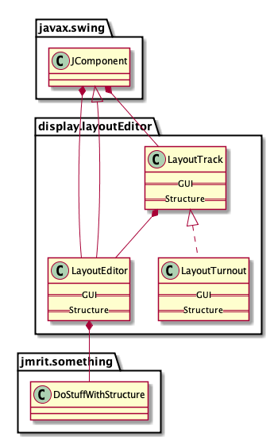
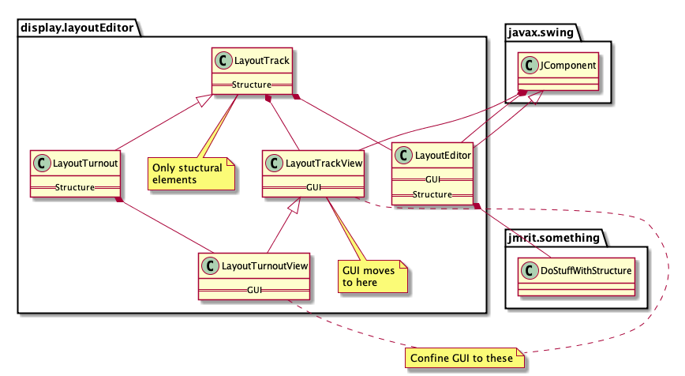
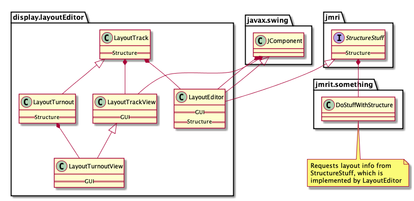
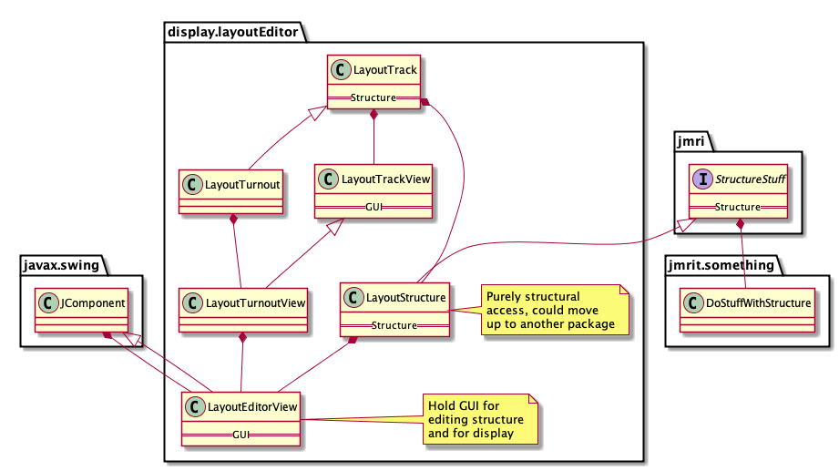

## Some notes on the Layout Editor migration project.

Where we are now:

Moving to MVC:

Lift accessor to JMRI package via temporary interface:

Separate out LayoutEditor class to MVC parts:

 --- 
 