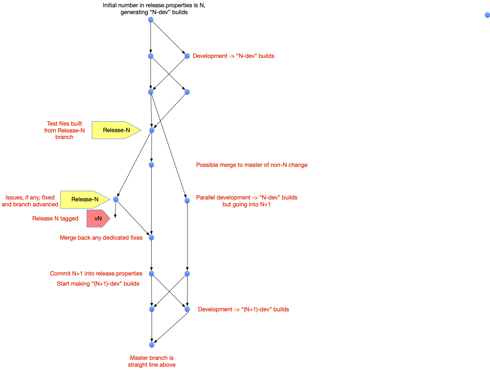

# How we build and release JMRI distributions
[Current online version](https://github.com/JMRI/JMRI/blob/master/scripts/HOWTO-distribution.md)

Our release procedure, in outline, creates a branch at some instant labeled with the release, building distribution files and checking them, and then applying a tag via GitHub to create the distribution. For more details, see below.

#### Note on release numbers and file names

Our released filenames are generated with [semantic versioning](http://semver.org) format in which the `+R202c9ee` indicates build meta-data, specifically the hash for the tag point.  Originally, the GitHub binary-file release system changed the '+' to a '.'. That was fixed at the start of 2018, so we no longer do it, though there are some old releases with that filename format.

### Issues

============================================================================

# Setup Instructions

People building releases for distribution need permission to directly operate with the JMRI/JMRI GitHub repository.

See the image at the bottom for how Git is used during this process. You should have your Git remotes set up in the [recommended fashion](https://www.jmri.org/help/en/html/doc/Technical/gitdeveloper.shtml#repo).

To check, run this command:
```
        git remote -v
```
If everything is correct, it will show:
```
        github	https://github.com/JMRI/JMRI.git (fetch)
        github	https://github.com/JMRI/JMRI.git (push)
        origin	https://github.com/JMRI/JMRI.git (fetch)
        origin	https://github.com/yourname/JMRI.git (push)
```
If the first two lines that start with `github` are missing run the command:
```
        git remote add github https://github.com/JMRI/JMRI.git
```
If the third line says:
```
        origin	https://github.com/yourname/JMRI.git (fetch)
```
instead of
```
        origin	https://github.com/JMRI/JMRI.git (fetch)
```
then run:
```
        git remote set-url origin https://github.com/JMRI/JMRI.git
```

If you have changed anything, run this again to check:
```
        git remote -v
```

Note that this also applies to the JMRI/website repository. You will
need to have a fork of both JMRI/JMRI and JMRI/website repositores
and to have cloned both repositories to your local computer.

If you are not the owner of the JMRI project, you will need a token
to be able to push to the JMRI repository.

[Cloning with HTTPS URLs](https://docs.github.com/en/get-started/getting-started-with-git/about-remote-repositories#cloning-with-https-urls)

[Managing your personal access tokens](https://docs.github.com/en/authentication/keeping-your-account-and-data-secure/managing-your-personal-access-tokens)

[Your tokens](https://github.com/settings/tokens)

### Important note about GitHub Desktop

GitHub Desktop requires that git is setup as below

```
        origin	https://github.com/yourname/JMRI.git (fetch)
        origin	https://github.com/yourname/JMRI.git (push)
```

Therefore, if you are using GitHub Desktop, when you have completed the
building of the release, you need to run:

```
        git remote set-url origin https://github.com/yourname/JMRI.git
```

You can still use GitHub Desktop during the building of the release,
but with the settings required for the build, GitHub Desktop will not
see your own branches, only the branches in the JMRI/JMRI repository.

### Windows

If you're attempting to perform this on MS Windows, refer to the MS Windows notes section at the bottom of this document.

While doing the release, it might be useful to have [GitHub Desktop](https://github.com/apps/desktop). It makes it easy to see what you are about to commit. But it's not recommended to commit with GitHub Desktop since many of the `git commit` commands below only commits some of the changed files, not all of them. So run the git commands from the command line to get it right.

================================================================================
## Update Instructions

- Update this note by executing the following line in your JMRI repository directory while you _don't_ have this file open in an editor. There are more details in the update-HOWTO.sh comments; arguments when you run it should be last release, this release you're making, the next release; you may need to update what's below:
```
  ./scripts/update-HOWTO.sh 5.9.5 5.9.6 5.9.7
```
(if you have this file open in an editor, refresh the contents from disk after running the script)
then manually update the end of that line above in this document to be this version being made today, next version to be made later, one after that; i.e. when starting to do *.4, the arguments _after_ you edit it here are *.4 *.5 *.6

- To check the script ran OK, the following should be the release you're doing now: 5.9.5

- Make sure that the release.branch property in release.properties has the right value for what you want to do.  Typically, this has been a release from the `master` branch,
and that’s assumed here. Be careful of these instructions if you’re working from
something else.

================================================================================
## Notification

- Create a [GitHub Issue](https://github.com/JMRI/JMRI/issues) to hold discussion with conventional title "Create Test Release 5.9.5". (This [might already exist](https://github.com/JMRI/JMRI/issues?q=is%3Aissue+is%3Aopen+%22Create+Test+Release+5.9.5%22), if it was properly created at the end of the last build cycle)  Typical content:
```
This is the next release in the 5.6 cycle. It's intended to be created from the HEAD of the master branch.
```


================================================================================
## Update Content (Test Release Only)

- Go to the master branch on your local repository. Pull back from the main JMRI/JMRI repository to make sure you're up to date.
```
        git checkout master
        git pull
```

 - Make sure `git status` shows "up to date", not "ahead".

- If it's a new year, update through-now copyright dates (done for 2023):

    JMRI:
    * build.xml in the jmri.copyright.years property value
    * project.properties
    * xml/XSLT/build.xml
    * A flock of places in xml/XSLT/
    * scripts/WinInstallFiles/LaunchJMRI.nsi

    website:
    * Copyright.shtml (2 places)
    * Footer.shtml Footer_fr.shtml
    * Help.html
    * (grep -r for the previous year in the web site, xml; don't change initial copyright notices!)

- Bring in all possible GitHub JMRI/JMRI [pull requests](https://github.com/JMRI/JMRI/pulls). This includes PRs that have passed CI and have been approved, but have not yet reached the 24 hold time. PRs that have not passed CI and/or have not been approved should not be included. Do not merge PRs that are marked WIP or have an “After Next Test Release” label. If you do merge any, pull the master branch back to your local repository to include them in the build.

- Close the [current milestone](https://github.com/JMRI/JMRI/milestones) with the current release number. If there are any items open still (except the main "create release" one) either close them or change/remove the milestone.  We do this now so that maintainers will put the next milestone on future PRs

- We no longer check [sf.net patches](https://sourceforge.net/p/jmri/patches/)

- Update the decoder index to current contents

```
        ant realclean remakedecoderindex
```

- Check 'session.log' located in the log directory as some errors might not always be output to the console.
```
        cat $JMRIPREFS/log/session.log
```

- Check the changes

```
        git diff xml/decoderIndex.xml
```

- Check that the version attribute on the decoderIndex element is a large number. (It sometimes gets reset to 1 for some unknown reason) If you find that it’s been reset to one, set it to two more than the value in the previous release.  

- If OK, commit

```
        git commit -m"update decoder index" xml/decoderIndex.xml
```

- Update the help/en/Acknowledgements.shtml help page with any recent changes

- Remake the JmriHelp control files, webindex.shtml and webtoc.shtml.

```
        ant buildhelp
```

- Verify the results of the build process.  A file will be created for English only.

- Run PanelPro and make sure help works from the Help menu.

- Commit this back:
```
        git commit -m"JmriHelp indexing update" help/
```

================================================================================
## General Maintenance Items (Test Release Only)

- [ ] We roll some general code maintenance items into the release process. There should be automated and removed from here.


- Consider running jmri.ArchitectureCheck to recreate (and hopefully reduce) the known coupling exceptions in archunit_store/

```
        ant tests
        ./runtest.csh jmri.ArchitectureCheck
        git diff
```

- Perhaps even trim the archunit_ignore_patterns.txt contents.

```
        ${EDITOR} ./archunit_ignore_patterns.txt
```

- If you changed anything
```
        git commit -m"ArchitectureCheck update" archunit_store archunit_ignore_patterns.txt
```

- Run "ant decoderpro"; check for no startup errors, help index present and working OK; if problems, consult!

- This is a good place to check that the decoder XSLT transforms work

```
        cd xml/XSLT
        ant
        cd ../..
```

- This is a good place to make sure CATS still builds, see the [doc page](https://www.jmri.org/help/en/html/doc/Technical/CATS.shtml) - note that CATS may not been updated to compile cleanly with the most recent JMRI test version.

- If you changed anything, commit it back.

- Commit the current copy of these notes, then push directly back to master on GitHub.

```
        git commit -m"for 5.9.5" scripts/HOWTO-distribution.md
        git push github
```

================================================================================
## Create the Next Milestone and Release Note 

This section describes in detail the process for creating the release note for a test release.  For a production release, you will instead (1) copy the previous production release to make the new production release note (2) update the number, date, etc throughout (3) merge together the changes from all the preceeding test releases and (4) manually update the warnings section.

- Create a [new milestone](https://github.com/JMRI/JMRI/milestones) with the _next_ release number, dated the 2nd Saturday of the month (might be already there, we've been posting them a few in advance)

- Merge all relevant [PRs in the JMRI/website repository](https://github.com/JMRI/website/pulls) to ensure release note draft is up to date

- Create the _next_ release note. Best way to do this is to copy the current release note now, before you prune out all the headers and other info where changes weren't made. (We need to work through automation of version number values below) (If you're creating a production version, its release note is made from a merge of the features of all the test releases; also create the *.*.1 note for the next test release)

```
        cd ../website
        cd releasenotes
        git checkout master
        git pull
        cp jmri5.9.5.shtml jmri5.9.6.shtml
        $EDITOR jmri5.9.6.shtml
```

(edit the new release note accordingly)
 - change numbers throughout
 - move new warnings to old (see below)
 - remove old-version change notes

```
        git add jmri5.9.6.shtml
        git commit -m"start new 5.9.6 next release note" jmri5.9.6.shtml
        git push github
        cd ../../JMRI
```

- Check if any section headings were added to the release-note fragment

```
        diff help/en/releasenotes/current-draft-note.shtml help/en/releasenotes/jmri5.9-master.shtml | grep '<h'
```

   If there were, update the master copy

- Merge the release note body from help/en/releasenotes/current-draft-note.shtml in the JMRI/JMRI repository into the actual release note in website repository:
```
        ${EDITOR} help/en/releasenotes/current-draft-note.shtml ../website/releasenotes/jmri5.9.5.shtml
```

- Merge the new warnings (if any) from help/en/releasenotes/current-warnings.shtml in the JMRI/JMRI repository into the actual release note in website repository:
```
        ${EDITOR} help/en/releasenotes/current-draft-warnings.shtml ../website/releasenotes/jmri5.9.5.shtml
```

 - Add any new warnings to the old warnings section of the next (5.9.6) release note:
```
        ${EDITOR} ../website/releasenotes/jmri5.9.5.shtml ../website/releasenotes/jmri5.9.6.shtml
```

- Clean out the unneeded sections from the release note
```
        ${EDITOR} ../website/releasenotes/jmri5.9.5.shtml
```

- Create the new draft note section
```
        cp help/en/releasenotes/jmri5.9-master.shtml help/en/releasenotes/current-draft-note.shtml
        cp help/en/releasenotes/warnings-master.shtml help/en/releasenotes/current-draft-warnings.shtml
        git commit -m"start for 5.9.6 release note" help/en/releasenotes/*.shtml
        git push github
        git pull
```

- Commit release note, push and pull back
```
        cd ../website/releasenotes
        git commit -m"updated 5.9.5 release notes" jmri5.*
        git push github
        git pull
        cd ../../JMRI
```

- Check that the correct milestone is on all merged pulls. This is needed for the release note. Start with the list of PRs merged since the last test release was started (where the date at the end should be the date and optionally time of the last release or before) or [click here](https://github.com/JMRI/JMRI/pulls?utf8=✓&q=is%3Apr+is%3Amerged+no%3Amilestone++merged%3A%3E2020-06-01+)
```
        open 'https://github.com/JMRI/JMRI/pulls?utf8=✓&q=is%3Apr+is%3Amerged+no%3Amilestone++merged%3A%3E2022-05-24+'
```
For each, if it doesn't have the right milestone set, add the current milestone.’

====================================================================================
## Update Development Release Number on Master Branch to This Release Number

- Update the &lt;version> element in `pom.xml` to this release (confirm numbers OK, update-HOWTO might not have gotten them right: should be last release, this release)
```
        git checkout master
        git pull
        sed -i.bak s/5.9.4-SNAPSHOT/5.9.5-SNAPSHOT/g pom.xml
```

- Update the release.build property in `release.properties` to this release (numbers have to be manually updated to the last field now, so check the numbers in the following line)
```
        sed -i.bak s/release.build=4/release.build=5/g release.properties
```
 - Check that both those edits left 5.9.5 defined in the two files
 
```
        git commit -m"5.9.5 until next release" release.properties pom.xml
```

 - Recreate the Software BOM. For instructions on how to install `spdx-sbom-generator` see the [project page](https://github.com/opensbom-generator/spdx-sbom-generator). Note that a large number of changes from the previous version of the `lib/bom-Java-Maven.spdx` file are expected:  The bill of materials is processed in parallel, and the output order depends on which Maven repository respond quickest.
```
        spdx-sbom-generator -o lib
        git commit -m"SBOM update for 5.9.5" lib/bom-Java-Maven.spdx
        
        git push github
```

================================================================================
## Create the Release Branch

- Disable the [Jenkins Packages job](https://builds.jmri.org/jenkins/job/development/job/packages/) to prevent any hybrid development releases

- Do one more check that everything is committed (you should _not_ have any modified and added (e.g. green) files showing in `git status`, which might interfere)

```
        git checkout master
        git status
            (commit as needed)
        git push github
        git pull
```

- Remove the 5.9.5 milestone on [unmerged PRs or [click here]](https://github.com/JMRI/JMRI/pulls?q=is%3Aopen+is%3Apr+milestone%3A5.9.5)

- Check on GitHub that [`release.properties`](https://github.com/JMRI/JMRI/blob/master/release.properties) on `master` is showing 5.9.5

- Create a `release-5.9.5` branch on GitHub
```
        git checkout -b release-5.9.5
        git push github
```

- Put the following comment in the [release GitHub item](https://github.com/JMRI/JMRI/issues?q=is%3Aissue+is%3Aopen+%22Create+Test+Release+5.9.5%22) saying the branch exists, and all future changes should be documented in the new release note: (NOT FOR THE LAST TEST RELEASE FROM MASTER BEFORE A PRODUCTION RELEASE, see just below)

```
The release-5.9.5 branch has been created.

Maintainers, please set the 5.9.6 milestone on pulls from now on, as that will be the next test release.

Jenkins will be creating files shortly at the [CI server](https://builds.jmri.org/jenkins/job/testreleases/job/5.9.5/)
```


- For the last test release before a production release:

```
The release-5.9.5 branch has been created.

Maintainers, please set the (next series, i.e. 5.9.6) milestone on pulls from now on, as that will be the next test release from the HEAD of the master branch.

Jenkins will be creating files shortly at the [CI server](https://builds.jmri.org/jenkins/job/TestReleases/job/5.9.5/)

If you're developing any additional (post-5.9.5) changes that you want in the JMRI 5.6 production release, please start from this branch, i.e. do `git fetch; git checkout release-5.9.5; git checkout -b myBranchName` to start your work.
```


- Fetch back to make sure your repository is fully up to date but stay on the release-5.9.5 branch

================================================================================
## Build Files with Jenkins

(If you can't build with Jenkins, see the "Local Build Alternative" section near the bottom)

- Log in to the [Jenkins CI engine](https://builds.jmri.org/jenkins/job/TestReleases/) "Releases" section

- Click "New Item"

- Click "Copy Existing Item". Fill out the new 5.9.5 release name at the top. Enter the 5.9.2 most recent release at the bottom.  Click "OK"

- Update

        Description
        Source Code Management:
           Branch Specified:  5.9.5

- Check under Source Code Management, Additional Behaviours, Advanced Clone Behaviours "Shallow Clone" is checked, Shallow Clone Depth is 1, and time out is 20.

- Click "Save". If needed, click "Enable".

- The build will start shortly (or click "Build Now"). Wait for it to complete.

- Check the [signing-wget.log](https://builds.jmri.org/jenkins/job/testreleases/job/5.9.5/ws/%20signing-wget.log) file in the job’s workspace to make sure all the return codes are zero. This is the macOS signing process. A non-zero code indicates a problem with the signature. If there is a non-zero code, resolve that and rebuild before proceeding!

================================================================================
## Capture A Profile (Production releases only)

This should be done on a machine with only one display.

- On your local machine, start `jconsole`. Do

```
        ant realclean tests
        JMRI_OPTIONS=jmri.skipTestsRequiringSeparateRunning=true
        ant headlesstest
```

- Connect `jconsole` to the test class when it appears.

- When that's done, put a screen-shot of the four monitor graphs into the "[Create Test Release 5.9.5](https://github.com/JMRI/JMRI/issues?q=is%3Aissue+is%3Aopen+%22Create+Test+Release+5.9.5%22)" Github issue so that historical resource usage info is available.

================================================================================
## Put Files Out For Checking

- Change the release note to point to the just-built files (in CI or where you put them), commit, wait (or force via ["Build Now"](https://builds.jmri.org/jenkins/job/website/job/website-repository/) button). Confirm [visible on web](https://www.jmri.org/releasenotes/jmri5.9.5.shtml).

- Announce the file set via [email to jmri@jmri-developers.groups.io](mailto:jmri@jmri-developers.groups.io?subject=First%205.9.5%20files%20available) with a subject line


```
"First 5.9.5 files available":

First JMRI 5.9.5 files are available in the usual way at:

https://builds.jmri.org/jenkins/job/testreleases/job/5.9.5/

Feedback appreciated! I would like to release this later today or tomorrow morning if the files are OK on macOS, Linux and Windows.

Note that the purpose of this check is to make sure that the _files_ were built OK.  If you find any new problems in the code, great, let's fix those for the next test release.  (Or even better, let's learn to do better functional checking of the development releases leading up to the test release build)

```

- *Wait for some replies about all three platforms before proceeding*

================================================================================
## Further Changes to Contents Before Release

Do not allow changes between the last test release and a production release. If changes are needed, create another test release instead.

These instructions result in the initial release-5.9.5 branch label being attached to the master branch sequence.  If somebody commits to master after that, master will move along with additional contents. Once that happens, if you want to include _all_ merges to master to date, you can just move the release-5.9.5 branch forward on master to the current head (and update the release note, decoderIndex and help files as needed)

If you want to add something to release-5.9.5 and _not_ include other additions to master, you have to branch the contents of release-5.9.5 away from master.  This section describes how to do that.

- Ideally, start the work on either the release-5.9.5 branch (if working after that was started) or on a branch-from-master that's _before_ the release-5.9.5 branch was created.  That way, the change can be cleanly included in the release branch, and also directly onto master.

- Commit their changes to that branch, and push as needed to get it to their GitHub fork.

- On the GitHub web site, make _two_ pull requests:

   - One to master, as usual

   - One to the release branch e.g. "release-5.9.5".  The comment on this PR should explain why this should be included instead of waiting for the next release.

   Merging the PR to the master makes those changes available on further developments forever; the one on the release, if accepted, includes the change and kicks off new runs of the various CI and build jobs.

   Note: The GitHub automated CI tests do their build after doing a (temporary) merge with the target branch. If the release branch and master have diverged enough that a single set of changes can't be used with both, a more complicated procedure than above might be needed.  In that case, try a PR onto the release branch of the needed change, and then pull the release branch back onto the master branch before fixing conflicts.

- If somebody has merged their change into master (or it's branched from master later than the release tag), you have two choices:

   - Merge master into the release-5.9.5 branch.  This will bring _everything_ that's been merged in, so remember to update the version markers on those PRs.  Effectively, you've just started the release process later.

   - `git cherrypick` just the changes you want onto the release-5.9.5 branch. *This is not the recommended approach, as it is error-prone; we've had to withdraw releases in the past due to this.*  Read the documentation on that command carefully and double check your work. If possible, check the contents of the release branch on the GitHub web site to make sure only the changes you wanted were included.

- Make sure that the 5.9.5 milestone is on the original PR and any others that have been pulled in

- If the PR(s) has any changes to the help/en/releasenotes directory, go through the steps to update the master if any section(s) were added, and to move notes and warnings to the 5.9.5 release note.  Merge these as needed to the release-5.9.5 and master branches

- If needed, remake the decoder index and helpfile meta data

- Rerun the [Jenkins job]() to recreate the executables.

====================================================================================
## Create zipped .properties

Once you have acceptable files available, you can proceed.

The following will take several minutes, so be patient:

```
git checkout release-5.9.5
ant realclean compile
cd target
rm -f properties.5.9.5.zip

for x in `find classes -name \*.properties`; do
printf '%s\n' 0a '# from tag v5.9.5' . x | ex $x
done

find classes -name \*.properties | zip -@ properties.5.9.5.zip
cd ..
mkdir release
mv target/properties.5.9.5.zip release/
ls -lt release/
git checkout master

```

====================================================================================
## Format file-release information

Run a script to download the created files, create checksums and create text for release notes, etc
```
./scripts/releasesummary 5.9.5
```
(This attempts a very large download.  If it fails, [download the files](https://builds.jmri.org/jenkins/job/testreleases/job/5.9.5/) individually and put them in a `release/` directory in your working directory, then repeat the command)

This will print a bunch of text in several sections. Edit that into the website/releaselist, release note files and GitHub info below in this file.

```
${EDITOR} ../website/releaselist ../website/releasenotes/jmri5.9.5.shtml scripts/HOWTO-distribution.md
```

====================================================================================
## Create GitHub Release and upload files

Note: Once a GitHub Release is created it is *not* possible to change it to refer to different contents. *Once this step is done, you need to move on to the next release number.*

- Disable the Jenkins [release-build project](https://builds.jmri.org/jenkins/job/testreleases/job/5.9.5/); this is so it doesn't fail after later steps

- on GitHub JMRI/JMRI go to the "[releases](https://github.com/JMRI/JMRI/releases/new)" link, then click "Draft a new release" e.g.
```
    https://github.com/JMRI/JMRI/releases/new
```

- Fill out form:

   - "tag version field" gets v5.9.5 (note leading lower-case "v"!)
   - @ branch: select the release-5.9.5 release branch
   - "Release title" field gets "Prod/Test Release 5.9.5"
   - Description should contain text like (the releasesummary script above provided the correct filenames and hashes):

```

[Release notes](https://jmri.org/releasenotes/jmri5.9.5.shtml)

Checksums:

File | SHA256 checksum
---|---
[JMRI.5.9.5+R7726763089.dmg](https://github.com/JMRI/JMRI/releases/download/v5.9.5/JMRI.5.9.5+R7726763089.dmg) | 675c9ffd1ed9238d563ad0355b5c8bad0022933a7d8641a93cfa054b050c3354
[JMRI.5.9.5+R7726763089.exe](https://github.com/JMRI/JMRI/releases/download/v5.9.5/JMRI.5.9.5+R7726763089.exe) | d6db9e17e1b6d3c2e9f50daed08f1c7bfb5979fb34c7ab9dda1152ef41ce0729
[JMRI.5.9.5+R7726763089.tgz](https://github.com/JMRI/JMRI/releases/download/v5.9.5/JMRI.5.9.5+R7726763089.tgz) | 23573416ad1dc0c173d6d873e7cad3ddb5e8ef360b73ced8416790151906f3d4


```

- Attach files by selecting them or dragging them in from the release/ subdirectory. Make sure that the Linux one is .tgz, not .tar.

   Note there's a little progress bar that has to go across & "Uploading your release now..." has to complete before you publish; make sure all four files (three installers plus properties) are there.

- [ ] It's slow to upload from a typical home connection; we wish we had a way to cross-load them from Jenkins (see below)

- Wait for completion, which might be a while with big uploads

- Click "Publish Release"

- Reenable the [Jenkins Packages job](https://builds.jmri.org/jenkins/job/development/job/packages/) to restart creation of development releases

====================================================================================
## Check for Unmerged Changes

If there were changes once the release was tagged, it's important that those changes also get onto master. Normally this happens automatically with the procedure in "Further Changes" above. But we need to check. Start with your Git repository up to date on master and the release branch, and then (*need a cleaner, more robust mechanism for this*; maybe GitX or a PR?):

```
git diff master...release-5.9.5
```

Note that you're testing the merge of the release branch back onto master.  This should report no differences, with the possible exception of some auto-generated files:
```
xml/decoderIndex.xml
help/[en|fr]/webindex.shtml
help/[en|fr]/webtoc.shtml
help/[en|fr]/local/*

```
and perhaps (depending on merge history as the release branch was made) the control files:
```
pom.xml
release.properties
```

If there are any changes in other files, do both of:

   - Make sure they get moved back to the master branch

   - Figure out what went wrong and fix it in these instructions

====================================================================================
## Update GitHub Status items

- Create the [next GitHub Issue](https://github.com/JMRI/JMRI/issues/new) to hold discussion with conventional title "Create Test Release 5.9.6". Add the next release milestone (created above) to it. Typical text (get the date from the [milestone page](https://github.com/JMRI/JMRI/milestones)); for later releases in the series copy specific text from the milestone page:
```
This is the next release in the 5.10 cycle. It's intended to be created from the `HEAD` of the `master` branch.
```
- Add the 5.9.6 milestone to the issue.

- Confirm that the tag for the current release (v5.9.5 for release 5.9.5) is in place via the [tags page](https://github.com/JMRI/JMRI/tags), then manually delete the current release branch (release-5.9.5) via the [GitHub branches page](https://github.com/JMRI/JMRI/branches).  (N.B. We are experimenting with having the `release*` branches protected, in which case you may have to go to Setting; Branches; then edit the release* branch name to releaseX* to disable the protection before removing the branch.  If you do that, remember to replace the protection!)

- Go to the GitHub PR and Issues [labels list](https://github.com/JMRI/JMRI/labels) and remove any "[afterNextTestRelease](https://github.com/JMRI/JMRI/labels/After%20Next%20Test%20Release)" (and "[afterNextProductionRelease](https://github.com/JMRI/JMRI/labels/After%20Next%20Production%20Release)" if appropriate) labels from pending items

- If this is a production release, update the "Downloads" badge in the JMRI/JMRI README.md file in the JMRI and website repositories and commit back.

====================================================================================
## Associated Documentation

- Update the web site front page and downloads page:
```
        cd ../website
        ${EDITOR}  index.shtml download/Sidebar.shtml download/index.shtml
```

- Update the release note with date, name, remove warning about draft, download links, one last check of release numbers throughout
```
        ${EDITOR}  releasenotes/jmri5.9.5.shtml
```

- If this is a production release and there is no superceding test release, comment out the sections in index.shtml and download/index.shtml (three total) that list the current test release.  If this is the first test release of a new sequence, after a production release, uncomment those sections.

- Commit site, push to github
```
        git commit -m"5.9.5 web site" .
        git push github
        git pull
```

- Wait for update on JMRI web server (or [ask Jenkins](https://builds.jmri.org/jenkins/job/website/) to speed it along; note that you need to run both the “from JMRI repository” and “from JMRI website repository” jobs).

- Check the [web page](https://www.jmri.org) just in case you didn't push properly, etc

====================================================================================


## Announcement and Post-release Steps

- Mail announcement to

[jmriusers@groups.io](mailto:jmriusers@groups.io?subject=Test%20release%205.9.5%20of%20JMRI/DecoderPro%20is%20available%20for%20download&body=Test%20release%205.9.5%20of%20JMRI/DecoderPro%20is%20available%20for%20download.%0A%0AThis%20is%20the%20next%20in%20a%20series%20of%20test%20releases%20that%20will%20culminate%20in%20a%20production%20release,%20hopefully%20in%20December%202024.%20It's%20really%20helpful%20when%20people%20download,%20install%20and%20use%20these%20test%20releases%20so%20we%20can%20find%20and%20fix%20any%20inadvertent%20new%20problems%20early.%0A%0A-%20Alt:%20There%20have%20been%20a%20lot%20of%20updates%20in%20this%20release,%20so%20it%20should%20be%20considered%20experimental.%0A-%20Alt:%20We're%20getting%20close%20to%20the%20end%20of%20the%20development%20series,%20so%20we'd%20appreciate%20feedback%20on%20whether%20or%20not%20this%20release%20works%20for%20your%20layout.%0A%0AIf%20you%20are%20currently%20using%20JMRI%204.99.10%20or%20earlier,%20there%20is%20an%20update%20process%20that%20we%20strongly%20recommend.%20See%20the%20release%20note%20section%20on%20updates:%0A<https://www.jmri.org/releasenotes/jmri5.9.5.shtml#update>%0A%0AFor%20more%20information%20on%20the%20issues,%20new%20features%20and%20bug%20fixes%20in%205.9.5%20please%20see%20the%20release%20note:%0A<https://www.jmri.org/releasenotes/jmri5.9.5.shtml>%0A%0ANote%20that%20JMRI%20is%20made%20available%20under%20the%20GNU%20General%20Public%20License.%20For%20more%20information,%20please%20see%20our%20copyright%20and%20licensing%20page.%0A<https://www.jmri.org/Copyright.html>%0A%0AThe%20download%20links,%20along%20with%20lots%20of%20other%20information%20which%20we%20hope%20you'll%20read,%20can%20be%20found%20on%20the%20release%20note%20page:%0A<https://www.jmri.org/releasenotes/jmri5.9.5.shtml>%0A)

Subject:

   "Test release 5.9.5 of JMRI/DecoderPro is available for download"
    or
   "JMRI 5.4 is available for download"

Content:

    Test release 5.9.5 of JMRI/DecoderPro is available for download.

    This is the next in a series of test releases that will culminate in a production release, hopefully in December 2023. It's really helpful when people download, install and use these test releases so we can find and fix any inadvertent new problems early.

    If you are currently using JMRI 4.99.10 or earlier, there is an update process that we strongly recommend. See the release note section on updates:
    <https://www.jmri.org/releasenotes/jmri5.9.5.shtml#update>

    For more information on the issues, new features and bug fixes in 5.9.5 please see the release note:
    <https://www.jmri.org/releasenotes/jmri5.9.5.shtml>

    Note that JMRI is made available under the GNU General Public License. For more information, please see our copyright and licensing page.
    <https://www.jmri.org/Copyright.html>

    The download links, along with lots of other information which we hope you'll read, can be found on the release note page:
    <https://www.jmri.org/releasenotes/jmri5.9.5.shtml>

You might want to edit it, i.e. to add

    - Alt: There have been a lot of updates in this release, so it should be considered experimental.
    - Alt: We're getting close to the end of the development series, so we'd appreciate feedback on whether or not this release works for your layout.


- Close the [5.9.5 release GitHub Issue](https://github.com/JMRI/JMRI/issues?q=is%3Aissue+%22Create+Test+Release+5.9.5%22) with a comment saying that
```
    JMRI 5.9.5 has been released. Files are available in the GitHub release section.

```
- Commit this document and push back to GitHub

- For production releases, file copyright registration

    https://eco.copyright.gov/eService_enu/   (Firefox only!)
    
- For production release, consider updating the release plan page
    [https://www.jmri.org/help/en/html/doc/Technical/TechRoadMap.shtml](https://www.jmri.org/help/en/html/doc/Technical/TechRoadMap.shtml)

- Take a break!


====================================================================================
====================================================================================


# Additional Information

The rest of the document provides information about specific cases.

====================================================================================

## Git Usage During the Development and Release Process



====================================================================================
## Branches for preparation of Production Releases

If this release is one of the special series at the end of a development cycle that leads to a test release, create the next release branch right after you update the GitHub status items.  Those test releases are made cumulatively from each other, rather than each from master. We start the process now so that people can open pull requests for it, and discuss whether changes should be included.

(Maybe we should change their nomenclature to get this across?  E.g. instead of 4.5.5, 4.5.6, 4.5.7, 4.6 where the last two look like regular "from master" test releases, call them 4.5.6, 4.5.6.1, 4.5.6.2, 4.6 - this will make the operations clearer, but Version.java doesn't currently support it)

   - Create the next pre-production branch (*pre-production case only*):

```
git checkout (release-n.n.n)
git pull
git checkout -b (release-n.n.n+1)
git push github
```

====================================================================================
## Local-build Alternative

If you can't use Jenkins for the actual build, you can create the files locally. This will make the Windows and Linux installs correctly, but will leave the macOS installer unsigned (only Jenkins can use the signing certificates currently).

If you're building locally:

* You no need to have installed NSIS, as the two .exe files are pre-built.  If
you want to have it anyway to update the .nsi files and rebuild it, start by getting it from http://nsis.sourceforge.net (we use version 3.01 with long string support; see [Issue 3913](https://github.com/JMRI/JMRI/issues/3913) for instructions on how to build that for Linux). On macOS, install (currently [version 3.03](https://formulae.brew.sh/formula/makensis) via Homebrew
 - brew install makensis --with-large-strings
 - add an entry in "local.properties" nsis.home=/usr/local/bin/

* Either make sure that 'makensis' is in your path, or set nsis.home in your local.properties file to the root of the nsis installation:

```
        nsis.home=/opt/nsis/nsis-3.01/
```

- Get the release in your local work directory

```
    git checkout release-5.9.5
```

- edit release.properties to say `release.official=true` (near the bottom) **Do not commit this back**

- Do the build:

```
    ant -Dnsis.home="" clean packages
```

   Ant will do the various builds, construct the distribution directories, and finally construct the Linux, macOS and Windows distribution files in dist/releases/

- Put the Linux, macOS and Windows files where developers can take a quick look, send an email to the developer list, and WAIT FOR SOME REPLIES

================================================================================
## Notes for those attempting this on MS Windows platform:

Given that many of the steps involved assume the behaviour of certain POSIX commands (for which there are either no direct equivalent or have subtle behavioural differences), it is easiest to perform these tasks via Cygwin:

    https://cygwin.com/index.html

Cygwin is a set of tools to provide a POSIX-like experience on MS Windows.

(Better still, if possible, setup a Linux Virtual Machine under Windows - this will enable you to follow the 'normal' steps for non-Windows platforms)

Download the setup file for your platform (x86 or x86_64) and then run the installer, mainly using the defaults, but also add the following packages:

    curl
    dos2unix
    openssh
    rsync
    tcsh
    unzip

Other useful packages could be:

    nano        <-- a text editor
    ssh-pageant <-- allows use of PuTTY Pageant for sharing ssh key storage
                    between Windows and Cygwin sessions. Without, OpenSSH will
                    be used independently in Cygwin vs. Windows.
                    For set-up, see: https://github.com/cuviper/ssh-pageant

It will also be necessary to set-up/verify various environment variables:

    JAVA_HOME   <-- Location of JDK (i.e. C:\Program Files\Java\jdk1.8.0_25)
    PATH        <-- Needs to contain path towards ant

        PATH example (assuming Ant from NetBeans 8.0.1):
            for ant, add ";C:\Program Files\NetBeans 8.0.1\extide\ant\bin"

Once launched, it will be necessary to navigate to your local Windows drive:

    cd /cygdrive/c

Alternatively, if your work files are stored in 'Documents\JMRIDevelopment', you can create a symlink via:

    ln -s /cygdrive/c/Users/[userid]/Documents/JMRIDevelopment JMRIDevelopment

This will allow you to navigate straight from the Cygwin home to the JMRIDev directory via:

    cd JMRIDevelopment

Also, it will be necessary to work in a Cygwin-specific Git repository as one checked-out under MS Windows will have CRLF line-endings whereas one checked-out within Cygwin (and using the Cygwin svn tools) will have LF line-endings.

Some of the operations that are performed will still generate files with CRLF line-ends (even within the Cygwin environment) - for these, run the changed files through 'dos2unix'. To get a list of changed files, use 'git status' at top of repo.

================================================================================

## Possibilities for automating GitHub release creation:


Alternatively, if you have shell access to the Jenkins server, you perhaps can upload directly from there, once the initial draft release has been created (this hasn't been tested):

```
github-release upload -s {github_secret} -u JMRI -r JMRI -t v5.9.5 -n "JMRI.5.9.5+Rd144052.dmg" -f /var/lib/jenkins/jobs/testreleases/jobs/5.9.5/builds/4/archive/dist/release/JMRI.5.9.5+Rd144052.dmg
github-release upload -s {github_secret} -u JMRI -r JMRI -t v5.9.5 -n "JMRI.5.9.5+Rd144052.exe" -f /var/lib/jenkins/jobs/testreleases/jobs/5.9.5/builds/4/archive/dist/release/JMRI.5.9.5+Rd144052.exe
github-release upload -s {github_secret} -u JMRI -r JMRI -t v5.9.5 -n "JMRI.5.9.5+Rd144052.tgz" -f /var/lib/jenkins/jobs/testreleases/jobs/5.9.5/builds/4/archive/dist/release/JMRI.5.9.5+Rd144052.tgz
```

It might be possible to automate this in Ant, see http://stackoverflow.com/questions/24585609/upload-build-artifact-to-github-as-release-in-jenkins


